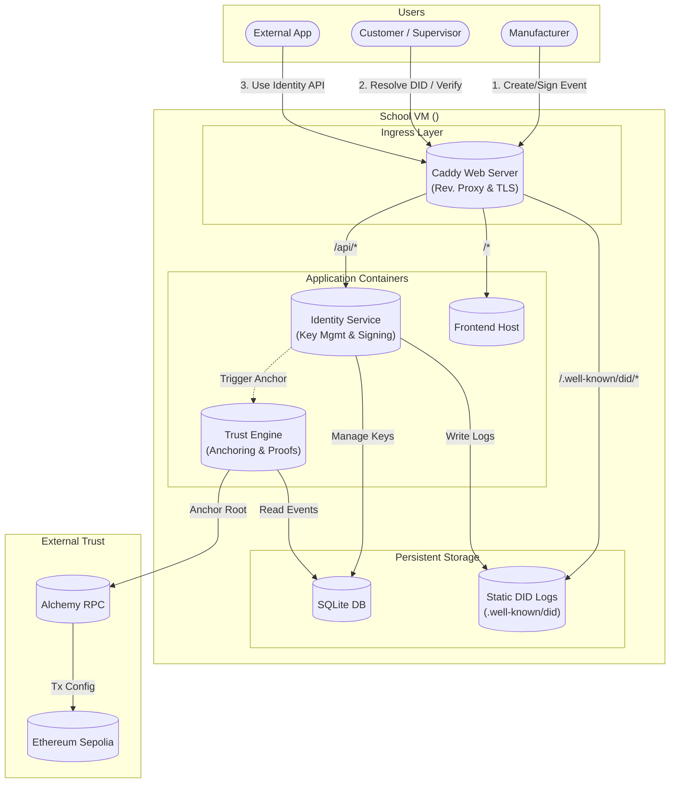
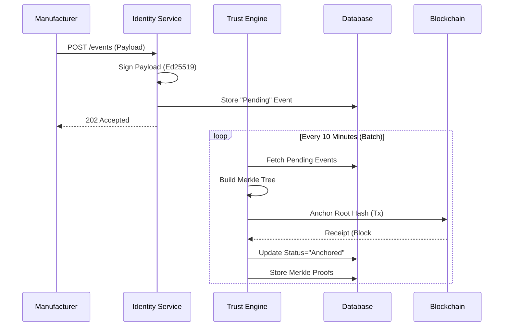
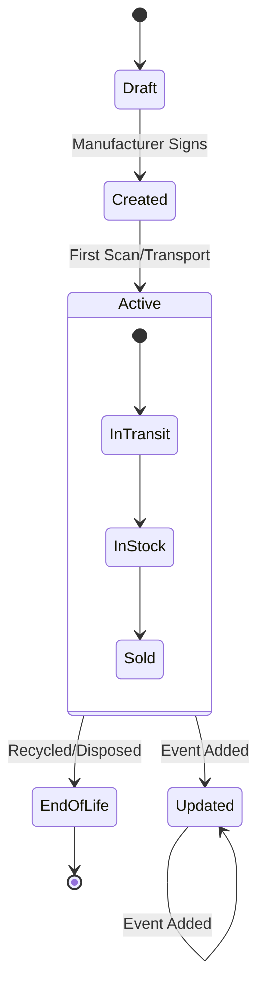

# Production Rollout Plan: Trust with DLT Technologies

## Executive Summary

This document provides a **complete, production-ready architecture and deployment plan** for transitioning the "Enabling Trust with DLT Technologies" prototype into a live environment on the Ethereum Sepolia testnet.

**Key Objectives:**
- **Zero-Cost Infrastructure**: Deploy on School VM (Ubuntu) using lightweight, open-source components.
- **Verifiable Identity (`did:webvh`)**: Implement a compliant, self-hosted Identity Service with hash-chained logs.
- **Trust Anchoring**: Batch and anchor event proofs to Ethereum Sepolia.
- **Privacy & Security**: Run strictly containing services using Docker to prevent environment pollution.

> **Note on Implementation Details**: All source code, configuration files (Caddyfile, Dockerfile), and smart contracts have been moved to **[PRODUCTION_CODE.md](./PRODUCTION_CODE.md)** to keep this strategic plan clean and readable.

---

## 1. System Landscape & Architecture

### 1.1 System Components Overview

| Component | Role | Rationale |
| :--- | :--- | :--- |
| **Frontend** | React + Vite | Client-side application for scanning and verifying passports. |
| **Web Server** | **Caddy** | Secure Reverse Proxy & Automatic HTTPS. Serves static DID logs and routes API traffic. |
| **Identity Service** | Node.js (Active) | **Active Server Process**. Manages DID creation, key rotation, and log chaining logic. |
| **Trust Engine** | Node.js (Module) | Handles event batching, Merkle tree construction, and Ethereum anchoring. |
| **Database** | SQLite | Local, persistent storage for events and identity state. Docker volume mounted. |
| **Infrastructure** | **Docker Containers** | strict isolation of services to maintain VM hygiene. |

### 1.2 Interaction Diagram



### 1.3 System Technology Stack

| Component | Technology | Rationale |
| :--- | :--- | :--- |
| **Container Engine** | **Docker + Compose** | Ensures reproducible builds and prevents "it works on my machine" issues. Keeps the host VM clean. |
| **Proxy / Web** | **Caddy** | Chosen over Nginx for its automatic HTTPS management and simpler configuration syntax. |
| **Backend Runtime** | **Node.js** | Unified runtime for both Identity logic and Trust logic. |
| **Database** | **SQLite** | Serverless, zero-config, file-based storage perfect for this scale and VM topology. |
| **Blockchain** | **Ethereum Sepolia** | Industry standard for secure, immutable anchoring. |

### 1.4 Identity Layer Capabilities & Extensibility

The Identity Service is designed as a **Generic Enabler**. While used here for the DPP, it exposes a standard API that can be used by other applications (e.g., Supply Chain Tracking, Credential Issuance).

#### Capabilities
- **DID Management**: Create (`did:webvh`), Deactivate, Update.
- **Key Rotation**: Securely rotate cryptographic keys without breaking identity history.
- **Signing Oracle**: Sign arbitrary payloads (VCs, Events) using the managed keys.
- **Log Chaining**: Automatically calculate back-links and hash chains for compliance.

#### Extensibility API
External applications can integrate via REST:
- `POST /api/identity/create`: Generate new DID.
- `POST /api/identity/sign`: Request a signature for a payload.
- `GET /.well-known/did/{scid}`: Standard resolution (handled by Caddy).

---

## 2. Component Functionality Map

| Component | Primary Responsibilities | Inputs | Outputs |
| :--- | :--- | :--- | :--- |
| **Caddy** | - TLS Termination<br>- Static File Serving (Logbook)<br>- Request Routing | HTTPS Requests | Static Files, Proxied API Calls |
| **Identity Service** | - Key Generation (Ed25519)<br>- Log Appending (Hash Chain)<br>- Signature Generation | JSON Payloads | Signed Objects, Updated DID Logs (`did.jsonl`) |
| **Trust Engine** | - Event Aggregation<br>- Merkle Tree Construction<br>- Blockchain Interaction | Signed Events | Anchor Transactions, Merkle Proofs |
| **Frontend** | - QR Scanning<br>- **Client-Side Verification**<br>- Data Visualization | User Interaction | Verification Status (Valid/Invalid) |

---

## 3. Data & Process Flows

### 3.1 Sequence: Event Creation & Anchoring



### 3.2 State Diagram: DPP Lifecycle



---

## 4. Pre-Requisites & Manual Setup (IMPORTANT)

**⚠️ You must complete these manual steps before deployment. These involve creating external accounts that cannot be automated.**

### 4.1 Create Alchemy Account & Get RPC URL
**Purpose**: Alchemy provides the connection to Ethereum Sepolia testnet without running your own node.
1. Go to [alchemy.com](https://www.alchemy.com/)
2. Sign up for a free account
3. Create a new App:
   - **Chain**: Ethereum
   - **Network**: Sepolia
   - **Name**: `DPP-Production`
4. Copy the **HTTPS URL** (looks like `https://eth-sepolia.g.alchemy.com/v2/YOUR_API_KEY`)
5. Save this as `ALCHEMY_SEPOLIA_URL` for your `.env` file.

### 4.2 Create Ethereum Wallet (Deployer)
**Purpose**: You need a wallet with Sepolia ETH to deploy the smart contract.
1. Install [MetaMask](https://metamask.io/)
2. Create a new wallet and switch to **Sepolia Testnet**
3. Export your **Private Key** (Settings -> Security -> Export Private Key)
   - ⚠️ **NEVER share this or commit it to git!**
4. Save this as `DEPLOYER_PRIVATE_KEY` for your `.env` file.

### 4.3 Get Sepolia Test ETH
**Purpose**: Pay for gas fees (free on testnet).
1. Use a Faucet:
   - [Alchemy Sepolia Faucet](https://sepoliafaucet.com/)
   - [Google Cloud Web3 Faucet](https://cloud.google.com/application/web3/faucet/ethereum/sepolia)
2. Get at least **0.05 SepoliaETH**.

### 4.4 Create Relayer Wallet (Operational)
**Purpose**: A separate wallet for the backend to send daily anchor transactions.
1. Create a second account in MetaMask named `DPP-Relayer`
2. Export its Private Key.
3. Save as `RELAYER_PRIVATE_KEY` for your `.env` file.
4. Send **0.02 SepoliaETH** from your Deployer wallet to this Relayer wallet.

### 4.5 Configure DNS (Crucial for HTTPS)
**Purpose**: Point your domain to the VM so Caddy can provision an SSL certificate.
1. Log in to your Domain Registrar (e.g., TransIP, GoDaddy).
2. Go to DNS Management.
3. Add a new **A Record**:
   - **Name**: `webvh` (creates `webvh.web3connect.nl`)
   - **Value**: Your VM IP Address (e.g., `51.77.71.29`)
   - **TTL**: 5 min / Automatic.
4. Wait 5-10 minutes for propagation.

### 4.6 Server Preparation (On VM)
**Purpose**: Ensure the School VM is ready to run containers.
1. SSH into your VM.
2. Install Docker & Compose:
   ```bash
   sudo apt-get update
   sudo apt-get install -y docker.io docker-compose
   ```
3. Verify installation:
   ```bash
   docker --version
   docker-compose --version
   ```

---

## 5. Deployment Guide: Docker Strategy

**Motivation**: We use Docker to isolate our dependencies (Node.js version, Caddy version) from the host VM. This prevents "pollution" of the School VM and makes the system easy to start/stop/clean.

### 5.1 Instructions
(Detailed implementation logic is in **[PRODUCTION_CODE.md](./PRODUCTION_CODE.md)**)

1.  **Clone & Configure**:
    ```bash
    git clone <repo>
    cd deployment
    cp .env.example .env
    # Edit .env with the keys gathered in Section 4
    ```

2.  **Build & Run**:
    ```bash
    docker-compose up --build -d
    ```

3.  **Verify**:
    - Frontend: `https://webvh.web3connect.nl`
    - API Health: `https://webvh.web3connect.nl/health`
    - DID Resolution: `https://webvh.web3connect.nl/.well-known/did/<did>/did.jsonl`

---

## 6. Pre-Implementation Checklist

- [ ] **Repo Hygiene**: Run BFG/Filter-Branch to remove exposed IPs from git history.
- [ ] **Infrastructure**: Install Docker & Docker Compose on School VM.
- [ ] **Accounts**: Alchemy App Created + RPC URL.
- [ ] **Wallets**: Deployer & Relayer wallets created and funded (Sepolia ETH).
- [ ] **Environment**: `.env` file created locally (do not commit!).
