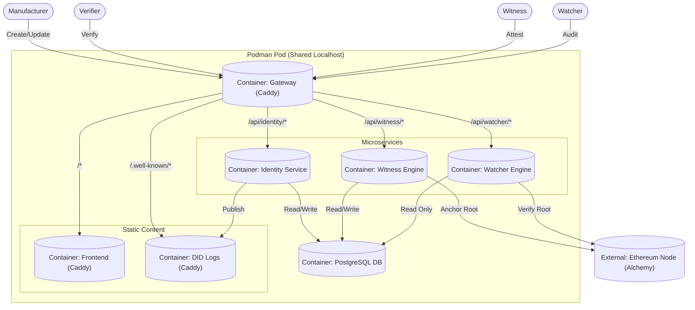
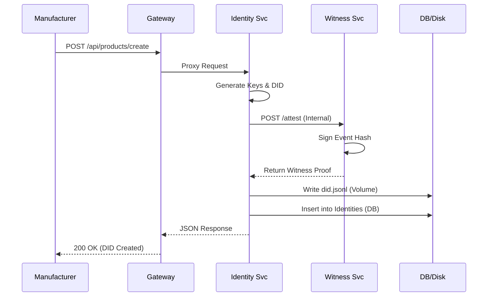
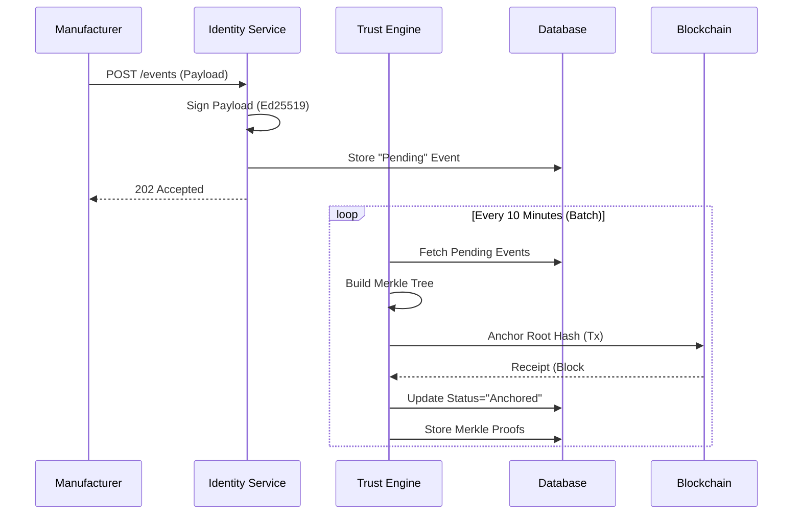

# Production Rollout Plan: Trust with DLT Technologies

## Executive Summary

This document provides a **complete, production-ready architecture and deployment plan** for transitioning the "Enabling Trust with DLT Technologies" prototype into a live environment on the Ethereum Sepolia testnet.

**Key Objectives:**
- **Zero-Cost Infrastructure**: Deploy on School VM (Ubuntu) using lightweight, open-source components.
- **Verifiable Identity (`did:webvh`)**: Implement a compliant, self-hosted Identity Service with hash-chained logs.
- **Trust Anchoring**: Batch and anchor event proofs to Ethereum Sepolia.
- **Privacy & Security**: Run strictly containing services using Docker to prevent environment pollution.

> **Note on Implementation Details**: All source code, configuration files (Caddyfile, Dockerfile), and smart contracts have been moved to **[PRODUCTION_CODE.md](./PRODUCTION_CODE.md)** to keep this strategic plan clean and readable.

---

## 1. System Landscape & Architecture

### 1.1 System Components Overview

| Component | Role | Rationale |
| :--- | :--- | :--- |
| **Frontend** | React + Vite | Client-side application for scanning and verifying passports. |
| **Gateway** | **Caddy + Coraza WAF** | Secure Reverse Proxy with **OWASP Core Rule Set**. |
| **Identity Service** | Node.js | Microservice: Manages DID creation and updates. |
| **Witness Engine** | Node.js | Microservice: Verifies events and creates Merkle trees. |
| **Watcher Engine** | Node.js | Microservice: Validates Merkle roots against Blockchain. |
| **Backend Runtime** | **Node.js** | Unified runtime for both Identity logic and Trust logic. |
| **DID Library** | **didwebvh-ts** | Official TypeScript library for did:webvh compliance and operations. |
| **Database** | **PostgreSQL** | Robust relational DB for shared state (DPPs, Events). |
| **Static Host** | **Caddy** | Dedicated lightweight servers for Frontend and DID Logs. |
| **Infrastructure** | **Podman Pod** | Secure, rootless container pod sharing strict localhost network. |

### 1.2 Interaction Diagram



### 1.3 System Data Flows

To understand how components communicate, here are the detailed flows for each stakeholder:

#### A. Manufacturer Creates a DID/Event
**Flow**: `User` → `Gateway` → `Identity Service` → `Witness Service` → `Disk/DB`
1.  **Manufacturer** sends "Create DID" request to **Gateway** (`/api/products/create`).
2.  **Gateway** routes to **Identity Service**.
3.  **Identity Service** creates the DID and keys.
4.  **Identity Service** calls **Witness Service** (internal HTTP) to request an attestation (signature).
5.  **Witness Service** signs the event hash and returns the proof.
6.  **Identity Service** writes the full log entry (with proof) to disk (`did-logs` volume).
7.  **Identity Service** saves the state to **PostgreSQL**.



#### B. Witness Anchors to Blockchain
**Flow**: `Cron Job` → `DB` → `Ethereum`
1.  **Witness Engine** runs a scheduled job (every 10 min).
2.  It queries **PostgreSQL** for unanchored events.
3.  It builds a Merkle Tree of these events.
4.  It sends the Merkle Root to **Ethereum (Sepolia)** via RPC.
5.  It updates **PostgreSQL** with the Transaction Hash.

#### C. Verifier checks a DID
**Flow**: `Verifier` → `Gateway` → `Static Host`
1.  **Verifier** scans a QR Code (URL).
2.  Browser requests `https://webvh.../.well-known/did/.../did.jsonl`.
3.  **Gateway** routes to **DID Logs Container** (Static Caddy).
4.  **DID Logs Container** serves the file significantly fast (no DB check needed).

#### D. Watcher Audits the System
**Flow**: `Watcher Engine` → `Ethereum` + `Gateway` → `DB`
1.  **Watcher Engine** wakes up (hourly).
2.  It fetches the latest Merkle Root from **Ethereum**.
3.  It reads the DID Logs (via Volume or Gateway).
4.  It recalculates the hashes and compares them to the Blockchain Root.
5.  If a mismatch is found, it writes an **Alert** to **PostgreSQL**.
| Component | Technology | Rationale |
| :--- | :--- | :--- |
| **Container Engine** | **Podman (Rootless)** | More secure than Docker (no daemon), easier to manage permissions on shared VMs. |
| **Gateway / WAF** | **Caddy + Coraza** | Automatic HTTPS + **OWASP Core Rule Set** for strict security. |
| **Services** | **Node.js** | Split microservices architecture for scalability and fault isolation. |
| **Database** | **PostgreSQL** | Robust RDBMS to handle concurrent writes from multiple services. |
| **Blockchain** | **Ethereum Sepolia** | Industry standard for secure, immutable anchoring. |

### 1.4 Stakeholder Roles in Trust Model

#### Witness Validators
**Purpose**: Independent third parties that attest to individual DID events.

**How they work:**
1. Manufacturer creates an event (e.g., "Window produced")
2. Witness receives notification or polls for new events
3. Witness validates:
   - Signature is cryptographically valid
   - Event data matches physical inspection
   - Hash chain is intact
4. Witness signs attestation and stores it
5. Attestation becomes part of the trust proof

**Technical flow:**
```
Witness → GET /.well-known/did/{scid}/did.jsonl
       → Verify Ed25519 signature on event
       → POST /api/witness/attest
       → Attestation stored in SQLite
```

#### Watcher Monitors
**Purpose**: Continuous monitoring agents that audit entire DID logbooks for integrity.

**How they work:**
1. Watcher periodically fetches complete `did.jsonl` logs
2. Validates entire hash chain from genesis to latest
3. Checks blockchain anchors match claimed Merkle roots
4. Raises alerts if:
   - Hash chain is broken
   - Signatures are invalid
   - Blockchain anchor mismatches
   - Unauthorized modifications detected

**Technical flow:**
```
Watcher → GET /.well-known/did/{scid}/did.jsonl (full log)
        → Validate hash(event[n]) == event[n+1].backlink
        → GET blockchain anchor at block X
        → Verify Merkle proof
        → POST /api/alerts if discrepancy found
```

**Key Difference:**
- **Witness** = Event-level attestation ("I verified this specific event")
- **Watcher** = System-level audit ("The entire logbook is consistent")

### 1.5 Identity Layer Capabilities & Extensibility

The Identity Service is designed as a **Generic Enabler**. While used here for the DPP, it exposes a standard API that can be used by other applications (e.g., Supply Chain Tracking, Credential Issuance).

#### Capabilities
- **DID Management**: Create (`did:webvh`), Deactivate, Update.
- **Key Rotation**: Securely rotate cryptographic keys without breaking identity history.
- **Signing Oracle**: Sign arbitrary payloads (VCs, Events) using the managed keys.
- **Log Chaining**: Automatically calculate back-links and hash chains for compliance.

#### Extensibility API
External applications can integrate via REST:
- `POST /api/identity/create`: Generate new DID.
- `POST /api/identity/sign`: Request a signature for a payload.
- `GET /.well-known/did/{scid}`: Standard resolution (handled by Caddy).

---

## 2. Component Functionality Map

| Component | Primary Responsibilities | Inputs | Outputs |
| :--- | :--- | :--- | :--- |
| **Caddy** | - TLS Termination<br>- Static File Serving (Logbook)<br>- Request Routing | HTTPS Requests | Static Files, Proxied API Calls |
| **Identity Service** | - Key Generation (Ed25519)<br>- Log Appending (Hash Chain)<br>- Signature Generation | JSON Payloads | Signed Objects, Updated DID Logs (`did.jsonl`) |
| **Trust Engine** | - Event Aggregation<br>- Merkle Tree Construction<br>- Blockchain Interaction | Signed Events | Anchor Transactions, Merkle Proofs |
| **Frontend** | - QR Scanning<br>- **Client-Side Verification**<br>- Data Visualization | User Interaction | Verification Status (Valid/Invalid) |

---

## 3. Technical Concepts Explained

This section provides detailed explanations of the core technologies and architectural patterns used in the system. Understanding these concepts is crucial for successful deployment and maintenance.

### 3.1 Reverse Proxy (Caddy's Primary Role)

**What it is**: A server that sits between clients (internet) and your backend services, forwarding requests to the appropriate service.

**Problem without Reverse Proxy:**
```
Internet → Direct connections to:
  - Frontend server (port 3000)
  - Identity Service (port 4000)
  - Static files (port 5000)

Issues:
  - Each service needs public IP or port exposure
  - Complex firewall rules
  - No centralized security
  - Multiple SSL certificates needed
```

**Solution with Caddy Reverse Proxy:**
```
Internet → Caddy (single entry: port 443)
           ├─ webvh.nl/           → Frontend container
           ├─ webvh.nl/api/       → Identity Service
           └─ webvh.nl/.well-known/ → Static DID logs

Benefits:
  ✓ Single public endpoint
  ✓ Hides internal architecture
  ✓ Centralized SSL/TLS management
  ✓ Easy to add services without exposing new ports
```

**Concrete Example in Production:**
```
User Request: https://webvh.web3connect.nl/api/events
              ↓
           Caddy receives on port 443
              ↓
           Matches /api/* rule
              ↓
           Forwards to identity-service:3000
              ↓
           Identity Service processes /events
              ↓
           Response flows back through Caddy
              ↓
           User receives HTTPS response
```

**Caddyfile Configuration:**
```
webvh.web3connect.nl {
    # Reverse proxy for API
    reverse_proxy /api/* identity-service:3000
    
    # Serve static DID logs
    handle /.well-known/did/* {
        root * /var/www/did-logs
        file_server
    }
    
    # Default: serve frontend
    root * /var/www/frontend
    file_server
}
```

### 3.2 TLS Certificate Automation

**The Manual Problem (Traditional Approach):**
1. Generate Certificate Signing Request (CSR) manually
2. Submit to Certificate Authority (CA)
3. Verify domain ownership via email/DNS
4. Download and install certificate files
5. Configure web server with cert paths
6. Set reminder for renewal in 90 days
7. Repeat entire process before expiry

**Caddy's Automatic Solution:**
```
You write:
  webvh.web3connect.nl { }

Caddy automatically:
  1. Detects HTTPS is needed
  2. Contacts Let's Encrypt API
  3. Completes ACME challenge (HTTP-01 or TLS-ALPN-01)
  4. Receives certificate
  5. Installs certificate
  6. Serves HTTPS immediately
  7. Auto-renews at 60 days (30 days before expiry)
```

**What happens behind the scenes:**
```
Startup:
  Caddy → "I need a cert for webvh.web3connect.nl"
  Caddy → Contacts Let's Encrypt
  LE    → "Prove you own this domain"
  Caddy → Serves special challenge file at /.well-known/acme-challenge/
  LE    → Verifies by fetching that file
  LE    → "Verified! Here's your certificate"
  Caddy → Installs cert + private key
  Caddy → Redirects all HTTP → HTTPS automatically

Every 60 days:
  Caddy → Checks cert expiry
  Caddy → Automatically renews if < 30 days remaining
  Caddy → Zero downtime (hot-swaps certificate)
```

**Result**: Green padlock 🔒 in browser without any manual work!

### 3.3 Scheduled Tasks (Cron-Style Batch Processing)

**What is Cron?**
A Unix time-based job scheduler. Think of it as an alarm clock for servers.

**Traditional Cron Syntax:**
```bash
# Format: minute hour day month weekday command
*/10 * * * * /usr/bin/node /app/anchor.js

Breakdown:
  */10 = Every 10 minutes
  *    = Every hour
  *    = Every day
  *    = Every month
  *    = Every weekday
```

**In Production Plan Context:**
The Trust Engine runs "cron-achtig" (=cron-style) meaning it executes periodically, not continuously.

**Implementation:**
The Trust Engine uses a Node.js-based scheduler (`node-cron`) to periodically batch pending events and anchor them to the blockchain. This avoids the need for system-level cron jobs configuration.

**How it works:**
1.  Scheduler wakes up (e.g., every 10 minutes).
2.  Fetches all unanchored events from SQLite.
3.  Constructs a Merkle Tree.
4.  Anchors root hash to Ethereum.
5.  Updates database with anchor details.

**Code Reference:** See [PRODUCTION_CODE.md § 2.4](./PRODUCTION_CODE.md#24-scheduler-implementation) for the implementation.

### 3.4 Docker Volumes (Persistent Storage)

**The Container Ephemeral Problem:**
```
Without volumes:
  docker-compose up   → Containers start, SQLite created
  docker-compose down → Containers deleted, SQLite GONE ❌
  docker-compose up   → Fresh containers, empty database
```

**Docker Volume Solution:**
```
With volumes:
  docker-compose up   → Containers start, mount volume
  docker-compose down → Containers deleted, volume REMAINS ✓
  docker-compose up   → New containers, same data
```

**Visual Architecture:**
```
┌──────────────────────────────────┐
│  Identity Service Container      │
│  (can be deleted/recreated)      │
│                                   │
│  /app/data/events.db ←───────┐  │
│                               │  │
└───────────────────────────────┘  │
                                   │
                          Mount point
                                   │
┌──────────────────────────────────┼──┐
│  Docker Volume: "db-data"        │  │
│  (persists on host VM)           ▼  │
│                                     │
│  /var/lib/docker/volumes/           │
│    db-data/_data/                   │
│      └─ events.db ← ACTUAL DATA    │
└─────────────────────────────────────┘
     ↑ Survives container deletion!
```

**docker-compose.yml Configuration:**
See [PRODUCTION_CODE.md § 5.2](./PRODUCTION_CODE.md#52-docker-compose) for the full configuration.

**Key Concept:**
We map a host directory (or named volume) to the container's `/app/data` directory. This ensures that even if the container crashes or is redeployed, the SQLite database file remains safe on the host.

### 3.5 Caddy Web Server

**What is Caddy?**
A modern, open-source web server that prioritizes ease of use and automatic HTTPS.

**Why Caddy?**
Caddy is chosen for its simplicity and automatic HTTPS handling. Unlike Nginx, which requires manual certificate management and complex configuration, Caddy handles TLS automatically via Let's Encrypt.

**Configuration:**
See [PRODUCTION_CODE.md § 5.1](./PRODUCTION_CODE.md#51-caddy-configuration) for the full `Caddyfile`.

**Architecture:**
Caddy acts as the single ingress point (port 443), routing requests to:
1.  **Identity Service** (`/api/*`)
2.  **Static DID Logs** (`/.well-known/did/*`)
3.  **Frontend App** (`/*`)

---

## 4. Data & Process Flows

### 3.1 Sequence: Event Creation & Anchoring




---

## 5. End-to-End Witness & Watcher Flows

This section provides concrete, step-by-step explanations of how the witness/watcher system operates using Merkle tree batching for scalable anchoring.

### 5.1 How Users Request and Receive DIDs

**Question**: "Hoe kan ik als gebruiker zo'n did.json aanvragen?"

**Answer**: Users don't directly request a `did.json`—instead, the system follows the **`did:webvh` specification** which uses `did.jsonl` (JSON Lines format) for the DID log.

**Step-by-Step Flow:**

```
1. Manufacturer Action: Create New Window
   POST https://webvh.web3connect.nl/api/products/create
   Body: {
     "type": "window",
     "model": "W-1200x1000-E30",
     "metadata": { ... }
   }

2. Identity Service Response:
   {
     "did": "did:webvh:z4oJ9Lq3KZ...:webvh.web3connect.nl",
     "versionId": "1-a3f12bc9e7d2",
     "status": "pending_witness"
   }

3. Automatic File Generation:
   /.well-known/did/z4oJ9Lq3KZ.../did.jsonl         ← DID Log (event history)
   /.well-known/did/z4oJ9Lq3KZ.../did-witness.json  ← Witness proofs

4. User Verification (later):
   GET https://webvh.web3connect.nl/.well-known/did/z4oJ9Lq3KZ.../did.jsonl
   → Returns full verifiable log
```

**File Structure After Creation:**
```
/var/www/html/.well-known/did/
└── abc123xyz/
    ├── did.jsonl          ← Event log with hash chain
    └── did-witness.json   ← Witness attestations & Merkle proofs
```

**Implementation:** See [PRODUCTION_CODE.md § 3.1](./PRODUCTION_CODE.md#31-product-creation-endpoint) for the complete `POST /api/products/create` endpoint implementation.

### 5.2 How did.jsonl is Updated

**Question**: "Hoe wordt de did.jsonl aangevuld?"

**Answer**: The `did.jsonl` is append-only and updated through a **witness-first workflow** to ensure integrity.

**Complete Update Flow:**

```
Step 1: Controller Creates Update
  Manufacturer → POST /api/events
  {
    "did": "did:webvh:...abc123xyz",
    "type": "transport",
    "data": { "location": "Rotterdam" }
  }

Step 2: Identity Service Prepares Entry
  - Generates versionId: "2"
  - Computes logEntryHash (sha256 of new entry)
  - Creates backlink to previous entry (hash chain)
  - Signs with controller key
  - Status: "pending_witness" (NOT published yet!)

Step 3: Request Witness Attestations
  Identity Service → Witness APIs (3 witnesses)
  POST https://witness1.example.com/api/attest
  {
    "did": "did:webvh:...abc123xyz",
    "versionId": "2",
    "logEntryHash": "ca978112...",
    "previousHash": "3e23e816...",
    "controllerSignature": "a3f12bc..."
  }

Step 4: Witnesses Verify & Sign
  Each witness:
    1. Fetches current did.jsonl
    2. Verifies hash chain integrity
    3. Validates controller signature
    4. Creates Data Integrity Proof:
       {
         "type": "DataIntegrityProof",
         "created": "2025-12-14T17:30:00Z",
         "verificationMethod": "did:web:witness1.example.com#key-1",
         "signature": "fb8e20fc2e4c3f..."
       }
    5. Returns proof to controller

Step 5: Controller Publishes Witness Proofs
  Identity Service writes to did-witness.json:
  [
    {
      "versionId": "2",
      "leafHash": "ca978112...",
      "merkleIndex": null,        ← Not batched yet
      "merkleProof": null,        ← Will be added later
      "witnessProofs": [
        { /* witness1 proof */ },
        { /* witness2 proof */ },
        { /* witness3 proof */ }
      ]
    }
  ]

Step 6: Publish Log Entry to did.jsonl
  ONLY after did-witness.json is updated:
  
  echo '{"versionId":"2","timestamp":"...","type":"transport",...}' >> did.jsonl

Step 7: Batch Anchoring (every 10 minutes)
  Trust Engine:
    1. Collects all pending updates (across ALL DIDs)
    2. Builds Merkle tree:
       Leaves = [hash(did1-v2), hash(did2-v5), hash(abc123xyz-v2), ...]
    3. Computes Merkle root
    4. Anchors root to Ethereum
    5. Updates did-witness.json with Merkle proofs

Step 8: did-witness.json Updated with Merkle Proof
  [
    {
      "versionId": "2",
      "leafHash": "ca978112...",
      "merkleIndex": 152,         ← Position in global tree
      "merkleProof": [             ← Path to root
        "2e7d2c03a9507ae...",
        "18ac3e7343f016...",
        "252f10c83610eb..."
      ],
      "witnessProofs": [ ... ]
    }
  ]
```

**Key Principle:** The `did-witness.json` file MUST be updated BEFORE `did.jsonl` to ensure atomic witnessing. This invariant is enforced in code to prevent publishing unwitnessed events.

**Implementation:** See [PRODUCTION_CODE.md § 3.2](./PRODUCTION_CODE.md#32-event-addition-with-witness-first-workflow) for:
- Complete `addEvent()` function with witness-first workflow
- Invariant enforcement code
- Witness attestation request logic

### 5.3 How Watchers Detect Fraudulent Events

**Question**: "Hoe controleert een watcher welke event niet klopt in de merkle tree?"

**Answer**: Watchers perform **independent cryptographic verification** by reconstructing the Merkle root and comparing it to the blockchain anchor.

**Watcher Verification Algorithm:**

```
Input: DID to audit (e.g., did:webvh:...abc123xyz)

Step 1: Fetch Files
  didLog = GET /.well-known/did/abc123xyz/did.jsonl
  witnessFile = GET /.well-known/did/abc123xyz/did-witness.json

Step 2: For Each Log Entry (versionId 1 → N):
  entry = didLog[i]
  witnessData = witnessFile.find(w => w.versionId == entry.versionId)
  
  ✓ Check 1: Hash Chain Integrity
    computed = hash(entry)
    if (didLog[i+1].previousHash !== computed) {
      ALERT: "Hash chain broken at version ${entry.versionId}"
    }
  
  ✓ Check 2: Controller Signature Valid
    if (!verify(entry.proof.signature, controllerPublicKey, entry)) {
      ALERT: "Invalid controller signature at version ${entry.versionId}"
    }
  
  ✓ Check 3: Witness Threshold Met
    if (witnessData.witnessProofs.length < 3) {
      ALERT: "Insufficient witnesses for version ${entry.versionId}"
    }
  
  ✓ Check 4: Witness Signatures Valid
    for each proof in witnessData.witnessProofs:
      witnessKey = resolve(proof.verificationMethod)
      if (!verify(proof.signature, witnessKey, witnessData.leafHash)) {
        ALERT: "Invalid witness signature from ${proof.verificationMethod}"
      }
  
  ✓ Check 5: Merkle Proof Valid (if anchored)
    if (witnessData.merkleProof !== null) {
      // Reconstruct root using Merkle path
      currentHash = witnessData.leafHash
      for each sibling in witnessData.merkleProof:
        currentHash = hash(currentHash + sibling) // Merkle hashing
      
      // Fetch blockchain anchor
      anchorRoot = getBlockchainAnchor(blockNumber)
      
      if (currentHash !== anchorRoot) {
        ALERT: "Merkle proof verification failed for version ${entry.versionId}"
        ALERT: "Expected root: ${anchorRoot}, computed: ${currentHash}"
      }
    }

Step 3: Cross-Check Published vs Witnessed
  publishedVersions = didLog.map(e => e.versionId)
  witnessedVersions = witnessFile.map(w => w.versionId)
  
  orphanedProofs = witnessedVersions.filter(v => !publishedVersions.includes(v))
  if (orphanedProofs.length > 0) {
    ALERT: "Controller published witness proofs but not log entries: ${orphanedProofs}"
  }

Result: VALID or ALERT[]
```

**Concrete Example of Fraud Detection:**

**Scenario**: Malicious controller tries to remove event versionId "5" after anchoring.

```
Original State (Honest):
  did.jsonl:
    v1: {..., hash: "aaa"}
    v2: {..., hash: "bbb", prev: "aaa"}
    v3: {..., hash: "ccc", prev: "bbb"}
    v4: {..., hash: "ddd", prev: "ccc"}
    v5: {..., hash: "eee", prev: "ddd"} ← Controller wants to delete this
    v6: {..., hash: "fff", prev: "eee"}
  
  Merkle Tree (already anchored):
    Leaves: ["aaa", "bbb", "ccc", "ddd", "eee", "fff"]
    Root: "xyz123" (on blockchain)

Fraudulent Attempt:
  Controller deletes v5 from did.jsonl:
    v1, v2, v3, v4, v6 (missing v5!)

Watcher Detection:
  1. Reads did.jsonl → Missing v5
  2. Reads did-witness.json → v5 still has merkleProof!
  3. Tries to verify v6:
     - v6.previousHash = "eee"
     - But v5 is missing from log
     - Hash chain broken! ❌
  
  4. Reconstructs Merkle root:
     - Leaves without v5: ["aaa", "bbb", "ccc", "ddd", "fff"]
     - Computed root: "abc999"
     - Blockchain root: "xyz123"
     - Mismatch! ❌
  
  ALERT: "DID abc123xyz is COMPROMISED"
  Evidence: "Missing versionId 5, hash chain broken, Merkle root mismatch"
```

**Implementation:** See [PRODUCTION_CODE.md § 3.3](./PRODUCTION_CODE.md#33-watcher-audit-implementation) for:
- Complete `auditDID()` function with all 5 verification checks
- `verifyMerkleProof()` Merkle root reconstruction algorithm
- Alert generation and classification logic

### 5.4 UI/UX Integration

**Question**: "Hoe wordt de UI/UX geupdatet met deze nieuwe aanpassingen?"

**Answer**: The frontend displays **real-time verification status** by querying both DID logs and blockchain anchors.

**User Flow in Frontend:**

```
1. User Scans QR Code on Window
   QR Contains: did:webvh:z4oJ9Lq3KZ...:webvh.web3connect.nl

2. Frontend Fetches DID Data
   const did = extractFromQR();
   const [didLog, witnessFile] = await Promise.all([
     fetch(`/.well-known/did/${scid}/did.jsonl`),
     fetch(`/.well-known/did/${scid}/did-witness.json`)
   ]);

3. Client-Side Verification (Progressive Display)
   
   ✓ Step 1: Show Product Info (fast)
     Display: "Window W-1200x1000-E30"
     Display: "Manufactured: 2025-01-15"

   ✓ Step 2: Verify Hash Chain (fast, ~100ms)
     for each entry: check hash(entry[i]) === entry[i+1].previousHash
     Display: "✓ Event history intact"

   ✓ Step 3: Verify Witness Signatures (medium, ~500ms)
     for each witness proof: verify Ed25519 signature
     Display: "✓ Attested by 3 independent witnesses"

   ✓ Step 4: Verify Blockchain Anchor (slow, ~2s)
     if (witnessFile[latest].merkleProof) {
       const root = reconstructMerkleRoot(leafHash, merkleProof);
       const onChainRoot = await contract.getMerkleRoot(blockNumber);
       if (root === onChainRoot) {
         Display: "✓ Anchored on Ethereum Sepolia (Block #123456)"
       }
     } else {
       Display: "⏳ Pending blockchain anchor (next batch)"
     }

4. Trust Score Calculation
   score = 0
   if (hashChainValid) score += 30;
   if (witnessProofsValid >= 3) score += 40;
   if (blockchainAnchorValid) score += 30;
   
   Display: "Trust Score: ${score}/100"
   Color: score > 90 ? green : score > 60 ? yellow : red

5. Event Timeline Display
   for each event in didLog:
     const witness = witnessFile.find(w => w.versionId === event.versionId);
     render({
       time: event.timestamp,
       type: event.type,
       witnessed: witness.witnessProofs.length >= 3 ? "✓" : "⏳",
       anchored: witness.merkleProof ? "✓" : "⏳"
     });
```

**UI Components:** See [PRODUCTION_CODE.md § 4.2](./PRODUCTION_CODE.md#42-react-trust-validation-component) for the complete `TrustValidationTab` React component with progressive verification display.

**New Dashboard Features:**

1. **Witness Dashboard** (already exists)
   - Shows all pending attestation requests
   - Allows witnesses to approve/reject events
   - Displays signing status per event

2. **Watcher Dashboard** (already exists)
   - Shows audit results for all monitored DIDs
   - Alerts for integrity violations
   - Merkle proof verification status

3. **Consumer View** (enhanced)
   - Shows visual trust indicators
   - Displays witness names/logos
   - Shows blockchain transaction link


**Code References** (see [PRODUCTION_CODE.md](./PRODUCTION_CODE.md)):
- § Identity Service API Endpoints: `/api/products/create` implementation
- § Witness Integration: Attestation request logic
- § Trust Engine Batching: Merkle tree construction & anchoring
- § Smart Contract: `anchorBatch(bytes32 merkleRoot)` function
- § Frontend Verification: Client-side Merkle proof verification

---

## 6. Pre-Requisites & Manual Setup (IMPORTANT)

**⚠️ You must complete these manual steps before deployment. These involve creating external accounts that cannot be automated.**

### 6.1 Create Alchemy Account & Get RPC URL
**Purpose**: Alchemy provides the connection to Ethereum Sepolia testnet without running your own node.
1. Go to [alchemy.com](https://www.alchemy.com/)
2. Sign up for a free account
3. Create a new App:
   - **Chain**: Ethereum
   - **Network**: Sepolia
   - **Name**: `DPP-Production`
4. Copy the **HTTPS URL** (looks like `https://eth-sepolia.g.alchemy.com/v2/YOUR_API_KEY`)
5. Save this as `ALCHEMY_SEPOLIA_URL` for your `.env` file.

### 4.2 Create Ethereum Wallet (Deployer)
**Purpose**: You need a wallet with Sepolia ETH to deploy the smart contract.
1. Install [MetaMask](https://metamask.io/)
2. Create a new wallet and switch to **Sepolia Testnet**
3. Export your **Private Key** (Settings -> Security -> Export Private Key)
   - ⚠️ **NEVER share this or commit it to git!**
4. Save this as `DEPLOYER_PRIVATE_KEY` for your `.env` file.

### 4.3 Get Sepolia Test ETH
**Purpose**: Pay for gas fees (free on testnet).
1. Use a Faucet:
   - [Alchemy Sepolia Faucet](https://sepoliafaucet.com/)
   - [Google Cloud Web3 Faucet](https://cloud.google.com/application/web3/faucet/ethereum/sepolia)
2. Get at least **0.05 SepoliaETH**.

### 4.4 Create Relayer Wallet (Operational)
**Purpose**: A separate wallet for the backend to send daily anchor transactions.
1. Create a second account in MetaMask named `DPP-Relayer`
2. Export its Private Key.
3. Save as `RELAYER_PRIVATE_KEY` for your `.env` file.
4. Send **0.02 SepoliaETH** from your Deployer wallet to this Relayer wallet.

### 4.5 Configure DNS (Crucial for HTTPS)
**Purpose**: Point your domain to the VM so Caddy can provision an SSL certificate.
1. Log in to your Domain Registrar (e.g., TransIP, GoDaddy).
2. Go to DNS Management.
3. Add a new **A Record**:
   - **Name**: `webvh` (creates `webvh.web3connect.nl`)
   - **Value**: Your VM IP Address (e.g., `51.77.71.29`)
   - **TTL**: 5 min / Automatic.
4. Wait 5-10 minutes for propagation.

### 4.6 Server Preparation (On VM)
**Purpose**: Ensure the School VM is ready to run containers securely.
1. SSH into your VM.
2. Install Podman:
   ```bash
   sudo apt-get update
   sudo apt-get install -y podman podman-compose
   ```
3. Verify installation:
   ```bash
   podman --version
   ```

---

## 5. Deployment Guide: Podman Strategy

We use **Podman Pods** to group our containers. This allows them to share a network namespace (localhost communication) efficiently while staying isolated from the host.

### 5.1 Instructions
(Detailed implementation logic is in **[PRODUCTION_CODE.md](./PRODUCTION_CODE.md)**)

1.  **Clone & Configure**:
    ```bash
    git clone <repo>
    cd deployment
    cp .env.example .env
    # Edit .env with keys
    ```

2.  **Run with Podman**:
    ```bash
    # Podman Compose (uses the compose.yaml file)
    podman-compose up -d
    ```

3.  **Verify**:
    - Frontend: `https://webvh.web3connect.nl`
    - Identity Health: `https://webvh.web3connect.nl/api/identity/health`
    - Security Check: `curl -I https://webvh.web3connect.nl` (Check headers)

---

