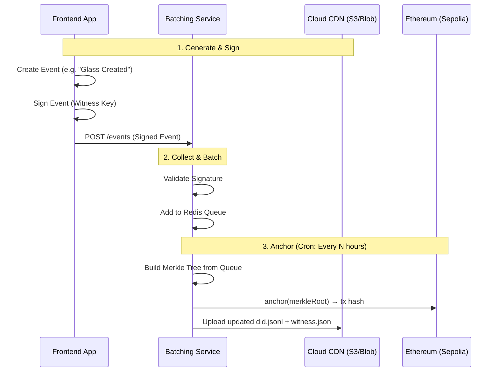
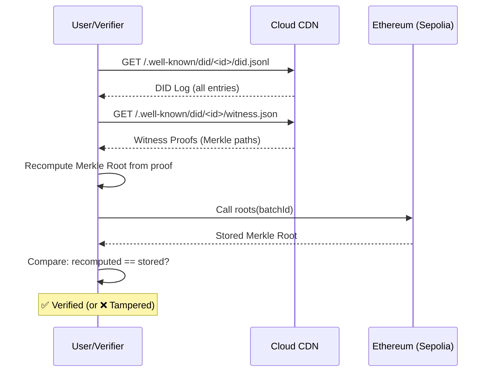

# Production Rollout Plan: Trust with DLT Technologies

This document outlines the strategic plan to move the "Enabling Trust with DLT Technologies" application from a prototype to a production-ready environment on the Ethereum Testnet (Sepolia).

---

## 1. System Architecture Overview

To achieve scalability and cost-efficiency while maintaining trust, we implement an **Off-Chain Witness / On-Chain Anchoring** architecture.

### 1.1 Anchoring Flow (Write Path)



### 1.2 Verification Flow (Read Path)



### 1.3 Core Components

| Component | Description |
|-----------|-------------|
| **Frontend Dashboard** | Existing React app for visualizing DPP lifecycle. |
| **Batching Service** | New Node.js middleware: collects events, builds Merkle Trees, anchors to Ethereum. |
| **Cloud Storage + CDN** | Azure Blob / AWS S3 with CloudFront/Front Door. Hosts `did:webvh` logs globally. |
| **Smart Contract** | `WitnessAnchorRegistry.sol` on Sepolia. Stores Merkle Roots with batch IDs. |

---

## 2. Implementation Strategy

### 2.A Blockchain Layer (Ethereum Sepolia)

**Contract:** `WitnessAnchorRegistry.sol`

```solidity
// SPDX-License-Identifier: MIT
pragma solidity ^0.8.20;

contract WitnessAnchorRegistry {
    uint256 public batchCount;
    mapping(uint256 => bytes32) public roots;
    mapping(uint256 => uint256) public timestamps;

    event Anchored(uint256 indexed batchId, bytes32 root, uint256 timestamp);

    function anchor(bytes32 merkleRoot) external returns (uint256 batchId) {
        batchId = batchCount++;
        roots[batchId] = merkleRoot;
        timestamps[batchId] = block.timestamp;
        emit Anchored(batchId, merkleRoot, block.timestamp);
    }

    function verify(uint256 batchId, bytes32 expectedRoot) external view returns (bool) {
        return roots[batchId] == expectedRoot;
    }
}
```

**Features:**
- `batchId`: Auto-incrementing identifier for each batch.
- `timestamps`: On-chain record of when each batch was anchored.
- `Anchored` event: Enables off-chain indexing and historical queries.

---

### 2.B Batching Service (Node.js/TypeScript)

**Infrastructure:** Dockerized container on ECS / Azure Container Apps.

**Responsibilities:**

| Step | Action |
|------|--------|
| **Ingest** | REST API `POST /events` receives signed witness events. |
| **Validate** | Verify signature against known public keys. |
| **Queue** | Store in Redis (handles burst loads). |
| **Batch** | Cron job (e.g., every 1 hour) pulls all pending events. |
| **Merkle** | Build Merkle Tree using `merkletreejs`. |
| **Anchor** | Call `anchor(root)` on Sepolia via `ethers.js`. |
| **Publish** | Upload updated `did.jsonl` and `witness.json` to S3/Blob. |

---

### 2.C Identity: `did:webvh` Log Management

**File Format:** Each DID has an **append-only log** stored as `did.jsonl` (JSON Lines).

**URL Structure:**
```
https://<domain>/.well-known/did/<scid>/did.jsonl
https://<domain>/.well-known/did/<scid>/witness.json
```

**Update Logic (Critical):**

```
1. Batching Service receives new event for DID X.
2. Download existing did.jsonl for DID X from S3.
3. Append new log entry to the file.
4. Re-upload the complete file to S3.
5. CDN cache invalidation (optional, or use short TTL).
```

**Concurrency Handling:**
- Use S3 conditional writes (`If-Match` with ETag) OR
- Serialize updates per DID in the Batching Service queue.

---

### 2.D Security: Key Management

| Environment | Strategy |
|-------------|----------|
| **Development** | `.env` file with `WITNESS_PRIVATE_KEY`. |
| **Production (Demo)** | Environment variables in container secrets (ECS Task Definition / Azure Key Vault reference). |
| **Production (Real)** | Hardware Security Module (HSM) or AWS KMS / Azure Key Vault for signing. |

**Key Rotation:**
- Generate new key pair.
- Update DID document to include new verification method.
- Old key remains valid for historical verification.

---

### 2.E Observability & Monitoring

| Concern | Solution |
|---------|----------|
| **Logging** | Structured JSON logs → CloudWatch / Grafana Loki. |
| **Metrics** | Prometheus: `events_received`, `batches_anchored`, `anchor_latency_seconds`. |
| **Alerting** | Alert if `anchor` transaction fails or queue depth > threshold. |
| **Tracing** | OpenTelemetry for request tracing through the system. |

---

## 3. Real-Life Data Generation

### 3.1 Hierarchy

| Level | Entity | Count | Relationship |
|-------|--------|-------|--------------|
| Main DPP | Window Unit | 1,000 | — |
| Sub-DPP | Glass Pane | 1,000 | 1:1 with Window |
| Sub-DPP | Frame | 1,000 | 1:1 with Window |

**Total DIDs:** 3,000

### 3.2 Data Scripts

1. **`generate-identities.ts`**: Creates 3,000 Ed25519 key pairs + initial `did.jsonl` files.
2. **`simulate-lifecycle.ts`**: Generates signed events: Manufacture → Assemble → Install.
3. **`seed-storage.ts`**: Bulk uploads all 3,000 DID files to S3/Blob.

---

## 4. Production Roadmap

### Phase 1: Infrastructure (Day 1-3)
- [ ] Create cloud account (Azure/AWS).
- [ ] Provision S3/Blob bucket + CDN.
- [ ] Deploy `WitnessAnchorRegistry.sol` to Sepolia.
- [ ] Obtain Sepolia ETH for relayer wallet.

### Phase 2: Backend (Day 4-7)
- [ ] Build Batching Service (Node.js + Redis + ethers.js).
- [ ] Implement S3/Blob upload with conditional writes.
- [ ] Implement Merkle Tree construction.
- [ ] Add structured logging + basic metrics.

### Phase 3: Data Seeding (Day 8-9)
- [ ] Run `generate-identities.ts` (3,000 DIDs).
- [ ] Run `simulate-lifecycle.ts` (12,000+ events).
- [ ] Run `seed-storage.ts` (upload to cloud).
- [ ] Trigger initial anchor batch.

### Phase 4: Frontend Integration (Day 10-12)
- [ ] Update React app to resolve DIDs via CDN.
- [ ] Implement proof verification UI (fetch proof → check against Sepolia).
- [ ] Display verification status (✅ Anchored / ⏳ Pending / ❌ Invalid).

### Phase 5: Testing & Hardening (Day 13-14)
- [ ] Load test with 10,000 events.
- [ ] Test failure scenarios (Redis down, Ethereum RPC failure).
- [ ] Document runbooks for common issues.

---

## 5. Open Decisions

> [!IMPORTANT]
> **Cloud Provider:** Azure or AWS? (Affects SDK choice and pricing.)

> [!IMPORTANT]
> **Domain Name:** For `did:webvh`, a real domain (e.g., `dpp.example.com`) is recommended. For MVP, the bucket URL works but is less clean.

> [!NOTE]
> **Batch Frequency:** Default to 1 hour. Can be adjusted based on gas costs and latency requirements.
