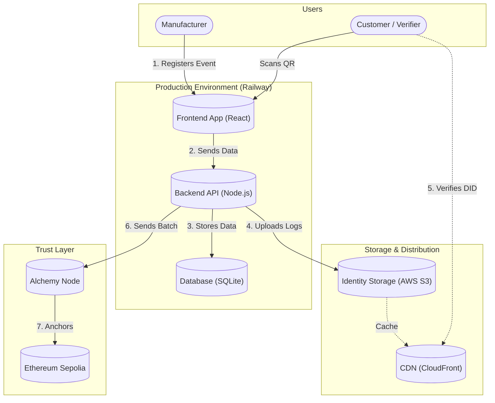

# Production Rollout Plan: Trust with DLT Technologies

## Executive Summary

This document provides a **complete, production-ready implementation plan** for transitioning the "Enabling Trust with DLT Technologies" prototype into a live environment on the Ethereum Sepolia testnet. The system demonstrates a fully functional Digital Product Passport (DPP) using `did:webvh` identities and blockchain-based verification.

**Key Objectives:**
- Deploy a working demo with **real blockchain anchoring** (not mock data)
- Implement proper `did:webvh` compliance with hash-chained logs
- Enable **client-side Merkle proof verification** (leaf → root)
- Deploy on free-tier infrastructure (Railway + Alchemy) at **€0 cost**

---

## 1. System Landscape & Architecture

### 1.1 System Components Overview

| System | Technology | Selection Rationale (Why?) |
|--------|------------|----------------------------|
| **Frontend** | React + Vite | Enables client-side verification directly in the user's browser, ensuring a zero-trust model. |
| **Backend** | Node.js + Express | Efficiently handles thousands of events via "Batch Anchoring", reducing blockchain interaction by 99%. |
| **Database** | SQLite + Volume | Lightweight, file-based persistence perfectly suits the single-container architecture, minimizing cloud complexity. |
| **Trust Anchor** | Ethereum Sepolia | The industry-standard testnet provides immutable proof at zero gas cost for the pilot phase. |
| **Identity Storage** | AWS S3 + CloudFront | Decouples public DID logs from the API server, ensuring high availability and global caching. |

### 1.2 Complete Interaction Diagram



### 1.3 Data Flow: Event Lifecycle

```
┌─────────────┐     ┌─────────────┐     ┌─────────────┐     ┌─────────────┐
│   Created   │────▶│   Stored    │────▶│   Batched   │────▶│  Anchored |
│  (Frontend) │     │  (SQLite)   │     │ (Merkle Tree)│    │ (Ethereum)  │
└─────────────┘     └─────────────┘     └─────────────┘     └─────────────┘
       │                   │                   │                   │
       ▼                   ▼                   ▼                   ▼
   User signs         anchored=0          leaf_hash set       anchored=1
   with Ed25519       in database         proof stored        tx_hash saved
```

---

## 2. Project Structure

```
Enabling-trust-with-DLT-technologies/  # Root (Current Frontend)
├── src/                         # Existing React app
│   ├── lib/
│   │   └── api/
│   │       └── client.ts        # [NEW] API client
│   ├── components/
│   │   ├── TrustValidationTab.tsx
│   │   ├── DIDEventsLog.tsx
│   │   └── DIDOperationsPanel.tsx
│   └── utils/
│       └── merkle.ts            # [NEW] Client-side verification
├── public/                      # Existing static assets
├── backend/                     # [NEW] Node.js API
│   ├── src/
│   │   ├── server.ts
│   │   ├── database.ts
│   │   ├── did-resolver.ts
│   │   ├── batch-processor.ts
│   │   ├── crypto.ts
│   │   └── contract-abi.ts
│   ├── package.json
│   └── tsconfig.json
├── contracts/                   # [NEW] Smart Contracts
│   ├── contracts/
│   │   └── WitnessAnchorRegistry.sol
│   ├── scripts/
│   │   └── deploy.ts
│   ├── test/
│   └── hardhat.config.ts
├── deployment/                  # [NEW] Deployment configs
│   ├── Dockerfile
│   ├── railway.json
│   └── .env.example
├── scripts/                     # [NEW] Utilities
│   └── generate-demo-data.ts
├── index.html                   # Existing file
├── package.json                 # Existing frontend package.json
├── vite.config.ts               # Existing vite config
└── README.md
```

---

## 3. Smart Contract Implementation

### 3.1 WitnessAnchorRegistry.sol

**File:** `contracts/contracts/WitnessAnchorRegistry.sol`

```solidity
// SPDX-License-Identifier: MIT
pragma solidity ^0.8.20;

/**
 * @title WitnessAnchorRegistry
 * @notice Stores Merkle roots of batched DPP events for immutable verification
 * @dev Each batch contains multiple events hashed into a Merkle tree
 */
contract WitnessAnchorRegistry {
    /// @notice Counter for batch IDs (auto-incrementing)
    uint256 public batchCount;
    
    /// @notice Mapping from batchId to Merkle root
    mapping(uint256 => bytes32) public roots;
    
    /// @notice Mapping from batchId to block timestamp
    mapping(uint256 => uint256) public timestamps;
    
    /// @notice Mapping from batchId to block number (for Etherscan links)
    mapping(uint256 => uint256) public blockNumbers;

    /// @notice Emitted when a new batch is anchored
    event Anchored(
        uint256 indexed batchId, 
        bytes32 indexed root, 
        uint256 timestamp,
        uint256 blockNumber
    );

    /**
     * @notice Anchor a Merkle root to the blockchain
     * @param merkleRoot The root hash of the Merkle tree containing event hashes
     * @return batchId The ID assigned to this batch
     */
    function anchor(bytes32 merkleRoot) external returns (uint256 batchId) {
        batchId = batchCount++;
        roots[batchId] = merkleRoot;
        timestamps[batchId] = block.timestamp;
        blockNumbers[batchId] = block.number;
        
        emit Anchored(batchId, merkleRoot, block.timestamp, block.number);
    }

    /**
     * @notice Verify that a given root matches the stored root for a batch
     * @param batchId The batch to check
     * @param expectedRoot The root to compare against
     * @return bool True if roots match
     */
    function verify(uint256 batchId, bytes32 expectedRoot) external view returns (bool) {
        return roots[batchId] == expectedRoot;
    }
    
    /**
     * @notice Get full batch details
     * @param batchId The batch to query
     * @return root The Merkle root
     * @return timestamp When the batch was anchored
     * @return blockNum The block number
     */
    function getBatch(uint256 batchId) external view returns (
        bytes32 root,
        uint256 timestamp,
        uint256 blockNum
    ) {
        return (roots[batchId], timestamps[batchId], blockNumbers[batchId]);
    }
}
```

### 3.2 Hardhat Configuration

**File:** `contracts/hardhat.config.ts`

```typescript
import { HardhatUserConfig } from "hardhat/config";
import "@nomicfoundation/hardhat-toolbox";
import * as dotenv from "dotenv";

dotenv.config();

const config: HardhatUserConfig = {
  solidity: "0.8.20",
  networks: {
    sepolia: {
      url: process.env.ALCHEMY_SEPOLIA_URL || "",
      accounts: process.env.DEPLOYER_PRIVATE_KEY 
        ? [process.env.DEPLOYER_PRIVATE_KEY] 
        : [],
    },
  },
  etherscan: {
    apiKey: process.env.ETHERSCAN_API_KEY || "",
  },
};

export default config;
```

### 3.3 Deployment Script

**File:** `contracts/scripts/deploy.ts`

```typescript
import { ethers } from "hardhat";

async function main() {
  console.log("Deploying WitnessAnchorRegistry to Sepolia...");
  
  const WitnessAnchorRegistry = await ethers.getContractFactory("WitnessAnchorRegistry");
  const contract = await WitnessAnchorRegistry.deploy();
  
  await contract.waitForDeployment();
  const address = await contract.getAddress();
  
  console.log(`✅ WitnessAnchorRegistry deployed to: ${address}`);
  console.log(`   View on Etherscan: https://sepolia.etherscan.io/address/${address}`);
  console.log("");
  console.log("Add this to your .env file:");
  console.log(`CONTRACT_ADDRESS=${address}`);
}

main().catch((error) => {
  console.error(error);
  process.exitCode = 1;
});
```

---

## 4. Backend Implementation

### 4.1 Contract ABI

**File:** `backend/src/contract-abi.ts`

```typescript
export const WITNESS_ANCHOR_REGISTRY_ABI = [
  "function anchor(bytes32 merkleRoot) external returns (uint256 batchId)",
  "function verify(uint256 batchId, bytes32 expectedRoot) external view returns (bool)",
  "function roots(uint256 batchId) external view returns (bytes32)",
  "function timestamps(uint256 batchId) external view returns (uint256)",
  "function blockNumbers(uint256 batchId) external view returns (uint256)",
  "function getBatch(uint256 batchId) external view returns (bytes32 root, uint256 timestamp, uint256 blockNum)",
  "function batchCount() external view returns (uint256)",
  "event Anchored(uint256 indexed batchId, bytes32 indexed root, uint256 timestamp, uint256 blockNumber)"
];
```

### 4.2 Database with Persistence

**File:** `backend/src/database.ts`

```typescript
import sqlite3 from 'sqlite3';
import { open, Database } from 'sqlite';
import path from 'path';

let db: Database | null = null;

export async function initDB(): Promise<Database> {
  if (db) return db;
  
  // Use persistent volume path in production
  const dbPath = process.env.DATABASE_PATH || path.join(__dirname, '../data/dpp.sqlite');
  
  console.log(`📁 Database path: ${dbPath}`);
  
  db = await open({
    filename: dbPath,
    driver: sqlite3.Database
  });

  await db.exec(`
    -- DID Identities with full key material
    CREATE TABLE IF NOT EXISTS identities (
      did TEXT PRIMARY KEY,
      scid TEXT UNIQUE NOT NULL,
      public_key TEXT NOT NULL,
      private_key_encrypted TEXT,
      created_at INTEGER NOT NULL,
      updated_at INTEGER
    );

    -- DID Log entries (did:webvh compliance)
    CREATE TABLE IF NOT EXISTS did_log_entries (
      id INTEGER PRIMARY KEY AUTOINCREMENT,
      did TEXT NOT NULL,
      version_id INTEGER NOT NULL,
      version_time TEXT NOT NULL,
      method TEXT NOT NULL,
      previous_version_hash TEXT,
      update_keys TEXT,
      params TEXT NOT NULL,
      proof TEXT,
      created_at INTEGER NOT NULL,
      FOREIGN KEY(did) REFERENCES identities(did),
      UNIQUE(did, version_id)
    );

    -- Lifecycle events
    CREATE TABLE IF NOT EXISTS events (
      id INTEGER PRIMARY KEY AUTOINCREMENT,
      did TEXT NOT NULL,
      event_type TEXT NOT NULL,
      payload TEXT NOT NULL,
      signature TEXT NOT NULL,
      leaf_hash TEXT,
      timestamp INTEGER NOT NULL,
      batch_id INTEGER,
      anchored INTEGER DEFAULT 0,
      created_at INTEGER NOT NULL,
      FOREIGN KEY(did) REFERENCES identities(did)
    );

    -- Anchor batches
    CREATE TABLE IF NOT EXISTS batches (
      id INTEGER PRIMARY KEY AUTOINCREMENT,
      merkle_root TEXT NOT NULL,
      tx_hash TEXT NOT NULL,
      block_number INTEGER NOT NULL,
      event_count INTEGER NOT NULL,
      status TEXT DEFAULT 'confirmed',
      created_at INTEGER NOT NULL
    );

    -- Merkle proofs for each event
    CREATE TABLE IF NOT EXISTS witness_proofs (
      id INTEGER PRIMARY KEY AUTOINCREMENT,
      event_id INTEGER NOT NULL,
      batch_id INTEGER NOT NULL,
      leaf_hash TEXT NOT NULL,
      proof TEXT NOT NULL,
      leaf_index INTEGER NOT NULL,
      FOREIGN KEY(event_id) REFERENCES events(id),
      FOREIGN KEY(batch_id) REFERENCES batches(id),
      UNIQUE(event_id)
    );

    -- Indexes for performance
    CREATE INDEX IF NOT EXISTS idx_events_did ON events(did);
    CREATE INDEX IF NOT EXISTS idx_events_anchored ON events(anchored);
    CREATE INDEX IF NOT EXISTS idx_did_log_did ON did_log_entries(did);
  `);

  console.log("✅ Database initialized");
  return db;
}

export async function getDB(): Promise<Database> {
  if (!db) {
    return initDB();
  }
  return db;
}
```

### 4.3 Cryptographic Utilities

**File:** `backend/src/crypto.ts`

```typescript
import * as ed from '@noble/ed25519';
import { sha256 } from '@noble/hashes/sha256';
import { bytesToHex, hexToBytes } from '@noble/hashes/utils';

/**
 * Verify an Ed25519 signature
 */
export async function verifySignature(
  publicKeyHex: string,
  message: string,
  signatureHex: string
): Promise<boolean> {
  try {
    const publicKey = hexToBytes(publicKeyHex);
    const signature = hexToBytes(signatureHex);
    const messageBytes = new TextEncoder().encode(message);
    
    return await ed.verifyAsync(signature, messageBytes, publicKey);
  } catch (error) {
    console.error('Signature verification failed:', error);
    return false;
  }
}

/**
 * Verify an event signature by resolving the DID's public key
 */
export async function verifyEventSignature(
  did: string,
  payload: any,
  signature: string
): Promise<boolean> {
  const db = await import('./database').then(m => m.getDB());
  
  // Get public key from identity
  const identity = await db.get('SELECT public_key FROM identities WHERE did = ?', [did]);
  if (!identity) {
    console.error(`DID not found: ${did}`);
    return false;
  }
  
  // Canonicalize payload for verification
  const message = canonicalizeForSigning(did, payload);
  
  return verifySignature(identity.public_key, message, signature);
}

/**
 * Canonicalize event data for consistent hashing/signing
 */
export function canonicalizeForSigning(did: string, payload: any): string {
  return JSON.stringify({
    did,
    payload,
  }, Object.keys({ did, payload }).sort());
}

/**
 * Create SHA256 hash of data
 */
export function sha256Hash(data: string): string {
  const bytes = new TextEncoder().encode(data);
  return bytesToHex(sha256(bytes));
}

/**
 * Create leaf hash for Merkle tree
 */
export function createLeafHash(event: {
  did: string;
  event_type: string;
  payload: string;
  timestamp: number;
}): string {
  const canonical = JSON.stringify({
    did: event.did,
    event_type: event.event_type,
    payload: JSON.parse(event.payload),
    timestamp: event.timestamp
  });
  return sha256Hash(canonical);
}
```

### 4.4 DID Resolver (did:webvh Compliant)

**File:** `backend/src/did-resolver.ts`

```typescript
import { getDB } from './database';
import { sha256Hash } from './crypto';

interface DIDLogEntry {
  versionId: number;
  versionTime: string;
  method: 'create' | 'update' | 'deactivate';
  previousVersionHash?: string;
  updateKeys?: string[];
  params: {
    id: string;
    verificationMethod?: any[];
    authentication?: string[];
    service?: any[];
  };
  proof?: {
    type: string;
    created: string;
    verificationMethod: string;
    proofPurpose: string;
    proofValue: string;
  };
}

/**
 * Resolve a DID to its full log (did.jsonl format)
 * Returns newline-delimited JSON per did:webvh spec
 */
export async function resolveDID(scid: string): Promise<string> {
  const db = await getDB();
  
  const entries = await db.all(
    `SELECT * FROM did_log_entries 
     WHERE did = (SELECT did FROM identities WHERE scid = ?)
     ORDER BY version_id ASC`,
    [scid]
  );
  
  if (entries.length === 0) {
    throw new Error(`DID not found: ${scid}`);
  }
  
  // Format as JSONL (newline-delimited JSON)
  const jsonl = entries.map(entry => {
    const logEntry: DIDLogEntry = {
      versionId: entry.version_id,
      versionTime: entry.version_time,
      method: entry.method,
      params: JSON.parse(entry.params),
    };
    
    if (entry.previous_version_hash) {
      logEntry.previousVersionHash = entry.previous_version_hash;
    }
    if (entry.update_keys) {
      logEntry.updateKeys = JSON.parse(entry.update_keys);
    }
    if (entry.proof) {
      logEntry.proof = JSON.parse(entry.proof);
    }
    
    return JSON.stringify(logEntry);
  }).join('\n');
  
  return jsonl;
}

/**
 * Get witness proofs for a DID's events
 */
export async function getWitness(scid: string): Promise<object> {
  const db = await getDB();
  
  const proofs = await db.all(
    `SELECT 
       wp.event_id,
       wp.batch_id,
       wp.leaf_hash,
       wp.proof,
       wp.leaf_index,
       b.merkle_root,
       b.tx_hash,
       b.block_number
     FROM witness_proofs wp
     JOIN batches b ON wp.batch_id = b.id
     JOIN events e ON wp.event_id = e.id
     JOIN identities i ON e.did = i.did
     WHERE i.scid = ?
     ORDER BY e.timestamp ASC`,
    [scid]
  );
  
  return {
    scid,
    proofs: proofs.map(p => ({
      eventId: p.event_id,
      batchId: p.batch_id,
      leafHash: p.leaf_hash,
      proof: JSON.parse(p.proof),
      leafIndex: p.leaf_index,
      merkleRoot: p.merkle_root,
      txHash: p.tx_hash,
      blockNumber: p.block_number,
      etherscanUrl: `https://sepolia.etherscan.io/tx/${p.tx_hash}`
    }))
  };
}

/**
 * Create initial DID log entry
 */
export async function createDIDLogEntry(
  did: string,
  publicKey: string
): Promise<void> {
  const db = await getDB();
  
  const scid = did.split(':').pop()!;
  const now = new Date().toISOString();
  
  const params = {
    id: did,
    verificationMethod: [{
      id: `${did}#key-1`,
      type: 'Ed25519VerificationKey2020',
      controller: did,
      publicKeyMultibase: `z${publicKey}` // Multibase prefix for base58
    }],
    authentication: [`${did}#key-1`],
  };
  
  await db.run(
    `INSERT INTO did_log_entries 
     (did, version_id, version_time, method, update_keys, params, created_at)
     VALUES (?, ?, ?, ?, ?, ?, ?)`,
    [
      did,
      1,
      now,
      'create',
      JSON.stringify([`${did}#key-1`]),
      JSON.stringify(params),
      Date.now()
    ]
  );
}

/**
 * Add update entry to DID log with hash chaining
 */
export async function updateDIDLog(
  did: string,
  updateParams: Partial<DIDLogEntry['params']>,
  proofValue: string
): Promise<void> {
  const db = await getDB();
  
  // Get previous entry
  const previous = await db.get(
    `SELECT * FROM did_log_entries WHERE did = ? ORDER BY version_id DESC LIMIT 1`,
    [did]
  );
  
  if (!previous) {
    throw new Error('Cannot update non-existent DID');
  }
  
  // Hash the previous entry for chain integrity
  const previousHash = sha256Hash(JSON.stringify({
    versionId: previous.version_id,
    versionTime: previous.version_time,
    method: previous.method,
    params: JSON.parse(previous.params)
  }));
  
  const now = new Date().toISOString();
  const newVersionId = previous.version_id + 1;
  
  // Merge params
  const currentParams = JSON.parse(previous.params);
  const newParams = { ...currentParams, ...updateParams };
  
  await db.run(
    `INSERT INTO did_log_entries 
     (did, version_id, version_time, method, previous_version_hash, params, proof, created_at)
     VALUES (?, ?, ?, ?, ?, ?, ?, ?)`,
    [
      did,
      newVersionId,
      now,
      'update',
      `sha256:${previousHash}`,
      JSON.stringify(newParams),
      JSON.stringify({
        type: 'DataIntegrityProof',
        created: now,
        verificationMethod: `${did}#key-1`,
        proofPurpose: 'assertionMethod',
        proofValue
      }),
      Date.now()
    ]
  );
}
```

### 4.5 Batch Processor with Correct Merkle Implementation

**File:** `backend/src/batch-processor.ts`

```typescript
import { MerkleTree } from 'merkletreejs';
import { sha256 } from '@noble/hashes/sha256';
import { bytesToHex, hexToBytes } from '@noble/hashes/utils';
import { ethers } from 'ethers';
import { getDB } from './database';
import { createLeafHash } from './crypto';
import { WITNESS_ANCHOR_REGISTRY_ABI } from './contract-abi';

/**
 * SHA256 hash function for MerkleTree library
 * Must return Buffer for proper tree construction
 */
function sha256Buffer(data: Buffer): Buffer {
  return Buffer.from(sha256(data));
}

/**
 * Process pending events into a Merkle tree and anchor to Ethereum
 */
export async function processBatch(): Promise<{
  status: string;
  batchId?: number;
  txHash?: string;
  blockNumber?: number;
  eventCount?: number;
  merkleRoot?: string;
}> {
  const db = await getDB();
  
  // 1. Get all unanchored events
  const events = await db.all('SELECT * FROM events WHERE anchored = 0 ORDER BY id ASC');
  
  if (events.length === 0) {
    return { status: 'no_pending_events' };
  }
  
  console.log(`📦 Processing batch with ${events.length} events...`);
  
  // 2. Create leaf hashes for each event
  const leaves: Buffer[] = [];
  const leafHashes: string[] = [];
  
  for (const event of events) {
    const leafHash = createLeafHash(event);
    leafHashes.push(leafHash);
    leaves.push(Buffer.from(hexToBytes(leafHash)));
    
    // Store leaf hash in event record
    await db.run('UPDATE events SET leaf_hash = ? WHERE id = ?', [leafHash, event.id]);
  }
  
  // 3. Build Merkle Tree
  // IMPORTANT: hashLeaves=false because we already hashed them
  // sortPairs=true for deterministic tree structure
  const tree = new MerkleTree(leaves, sha256Buffer, { 
    sortPairs: true,
    hashLeaves: false
  });
  
  const merkleRoot = tree.getHexRoot();
  console.log(`🌳 Merkle root: ${merkleRoot}`);
  
  // 4. Anchor to Ethereum
  const provider = new ethers.JsonRpcProvider(process.env.ALCHEMY_SEPOLIA_URL);
  const wallet = new ethers.Wallet(process.env.RELAYER_PRIVATE_KEY!, provider);
  const contract = new ethers.Contract(
    process.env.CONTRACT_ADDRESS!,
    WITNESS_ANCHOR_REGISTRY_ABI,
    wallet
  );
  
  let txHash: string;
  let blockNumber: number;
  
  try {
    // Estimate gas first
    const gasEstimate = await contract.anchor.estimateGas(merkleRoot);
    console.log(`⛽ Estimated gas: ${gasEstimate.toString()}`);
    
    // Send transaction with 20% buffer
    const tx = await contract.anchor(merkleRoot, {
      gasLimit: Math.ceil(Number(gasEstimate) * 1.2)
    });
    
    console.log(`📤 Transaction sent: ${tx.hash}`);
    
    // Wait for confirmation
    const receipt = await tx.wait();
    
    if (receipt.status !== 1) {
      throw new Error('Transaction reverted');
    }
    
    txHash = receipt.hash;
    blockNumber = receipt.blockNumber;
    
    console.log(`✅ Anchored in block ${blockNumber}`);
    
  } catch (error: any) {
    console.error('❌ Anchor transaction failed:', error.message);
    
    // Mark events as failed (optional: implement retry queue)
    await db.run(
      'UPDATE events SET anchored = -1 WHERE anchored = 0'
    );
    
    throw error;
  }
  
  // 5. Save batch record
  const batchResult = await db.run(
    `INSERT INTO batches (merkle_root, tx_hash, block_number, event_count, created_at)
     VALUES (?, ?, ?, ?, ?)`,
    [merkleRoot, txHash, blockNumber, events.length, Date.now()]
  );
  
  const batchId = batchResult.lastID!;
  
  // 6. Save Merkle proofs for each event
  for (let i = 0; i < events.length; i++) {
    const leaf = leaves[i];
    const proof = tree.getProof(leaf);
    
    // Convert proof to storable format
    const proofData = proof.map(p => ({
      position: p.position,
      data: bytesToHex(p.data)
    }));
    
    await db.run(
      `INSERT INTO witness_proofs (event_id, batch_id, leaf_hash, proof, leaf_index)
       VALUES (?, ?, ?, ?, ?)`,
      [events[i].id, batchId, leafHashes[i], JSON.stringify(proofData), i]
    );
    
    // Mark event as anchored
    await db.run(
      'UPDATE events SET anchored = 1, batch_id = ? WHERE id = ?',
      [batchId, events[i].id]
    );
  }
  
  console.log(`🎉 Batch ${batchId} completed successfully`);
  
  return {
    status: 'success',
    batchId,
    txHash,
    blockNumber,
    eventCount: events.length,
    merkleRoot
  };
}

/**
 * Verify a Merkle proof locally
 */
export function verifyMerkleProof(
  leafHash: string,
  proof: Array<{ position: 'left' | 'right'; data: string }>,
  expectedRoot: string
): boolean {
  let computedHash = Buffer.from(hexToBytes(leafHash));
  
  for (const { position, data } of proof) {
    const sibling = Buffer.from(hexToBytes(data));
    
    if (position === 'left') {
      computedHash = sha256Buffer(Buffer.concat([sibling, computedHash]));
    } else {
      computedHash = sha256Buffer(Buffer.concat([computedHash, sibling]));
    }
  }
  
  return bytesToHex(computedHash) === expectedRoot.replace('0x', '');
}
```

### 4.6 Express Server with CORS and Security

**File:** `backend/src/server.ts`

```typescript
import express, { Request, Response, NextFunction } from 'express';
import cors from 'cors';
import helmet from 'helmet';
import rateLimit from 'express-rate-limit';
import path from 'path';

import { initDB, getDB } from './database';
import { resolveDID, getWitness, createDIDLogEntry } from './did-resolver';
import { processBatch, verifyMerkleProof } from './batch-processor';
import { verifyEventSignature, createLeafHash, sha256Hash } from './crypto';

const app = express();

// Security middleware
app.use(helmet());
app.use(cors({
  origin: process.env.FRONTEND_URL || '*',
  methods: ['GET', 'POST'],
  allowedHeaders: ['Content-Type', 'Authorization']
}));

// Rate limiting
const limiter = rateLimit({
  windowMs: 15 * 60 * 1000, // 15 minutes
  max: 100, // limit each IP to 100 requests per window
  message: { error: 'Too many requests, please try again later' }
});
app.use('/api/', limiter);

// Body parsing
app.use(express.json({ limit: '1mb' }));

// Serve frontend static files
app.use(express.static(path.join(__dirname, '../public')));

// Health check
app.get('/health', (req, res) => {
  res.json({ status: 'ok', timestamp: new Date().toISOString() });
});

// ============ DID RESOLUTION (did:webvh) ============

/**
 * GET /.well-known/did/:scid/did.jsonl
 * Returns DID log in JSONL format per did:webvh spec
 */
app.get('/.well-known/did/:scid/did.jsonl', async (req, res) => {
  try {
    const didLog = await resolveDID(req.params.scid);
    res.header('Content-Type', 'application/jsonl');
    res.send(didLog);
  } catch (error: any) {
    res.status(404).json({ error: error.message });
  }
});

/**
 * GET /.well-known/did/:scid/witness.json
 * Returns witness proofs for all events under this DID
 */
app.get('/.well-known/did/:scid/witness.json', async (req, res) => {
  try {
    const witness = await getWitness(req.params.scid);
    res.json(witness);
  } catch (error: any) {
    res.status(404).json({ error: error.message });
  }
});

// ============ EVENTS API ============

/**
 * POST /api/events
 * Submit a signed lifecycle event
 */
app.post('/api/events', async (req, res) => {
  try {
    const { did, event_type, payload, signature, timestamp } = req.body;
    
    // Validate required fields
    if (!did || !event_type || !payload || !signature) {
      return res.status(400).json({ error: 'Missing required fields' });
    }
    
    // Verify signature
    const isValid = await verifyEventSignature(did, payload, signature);
    if (!isValid) {
      return res.status(401).json({ error: 'Invalid signature' });
    }
    
    // Store event
    const db = await getDB();
    const result = await db.run(
      `INSERT INTO events (did, event_type, payload, signature, timestamp, created_at)
       VALUES (?, ?, ?, ?, ?, ?)`,
      [did, event_type, JSON.stringify(payload), signature, timestamp || Date.now(), Date.now()]
    );
    
    res.json({ 
      status: 'received',
      eventId: result.lastID,
      message: 'Event stored, pending anchoring'
    });
    
  } catch (error: any) {
    console.error('POST /api/events error:', error);
    res.status(500).json({ error: 'Internal server error' });
  }
});

/**
 * GET /api/events
 * List events, optionally filtered by DID
 */
app.get('/api/events', async (req, res) => {
  try {
    const db = await getDB();
    const { did, anchored } = req.query;
    
    let query = 'SELECT * FROM events';
    const params: any[] = [];
    const conditions: string[] = [];
    
    if (did) {
      conditions.push('did = ?');
      params.push(did);
    }
    if (anchored !== undefined) {
      conditions.push('anchored = ?');
      params.push(anchored === 'true' ? 1 : 0);
    }
    
    if (conditions.length > 0) {
      query += ' WHERE ' + conditions.join(' AND ');
    }
    query += ' ORDER BY timestamp DESC';
    
    const events = await db.all(query, params);
    
    res.json({ events });
    
  } catch (error: any) {
    console.error('GET /api/events error:', error);
    res.status(500).json({ error: 'Internal server error' });
  }
});

// ============ PROOFS API ============

/**
 * GET /api/proofs/:eventId
 * Get Merkle proof for a specific event
 */
app.get('/api/proofs/:eventId', async (req, res) => {
  try {
    const db = await getDB();
    const eventId = parseInt(req.params.eventId);
    
    const proof = await db.get(
      `SELECT 
         wp.*, 
         b.merkle_root, 
         b.tx_hash, 
         b.block_number,
         e.did,
         e.event_type,
         e.payload,
         e.timestamp
       FROM witness_proofs wp
       JOIN batches b ON wp.batch_id = b.id
       JOIN events e ON wp.event_id = e.id
       WHERE wp.event_id = ?`,
      [eventId]
    );
    
    if (!proof) {
      return res.status(404).json({ error: 'Proof not found (event may not be anchored yet)' });
    }
    
    res.json({
      eventId: proof.event_id,
      batchId: proof.batch_id,
      leafHash: proof.leaf_hash,
      proof: JSON.parse(proof.proof),
      leafIndex: proof.leaf_index,
      merkleRoot: proof.merkle_root,
      txHash: proof.tx_hash,
      blockNumber: proof.block_number,
      etherscanUrl: `https://sepolia.etherscan.io/tx/${proof.tx_hash}`,
      event: {
        did: proof.did,
        eventType: proof.event_type,
        payload: JSON.parse(proof.payload),
        timestamp: proof.timestamp
      }
    });
    
  } catch (error: any) {
    console.error('GET /api/proofs/:eventId error:', error);
    res.status(500).json({ error: 'Internal server error' });
  }
});

/**
 * POST /api/proofs/verify
 * Verify a Merkle proof client-side computation
 */
app.post('/api/proofs/verify', async (req, res) => {
  try {
    const { leafHash, proof, expectedRoot } = req.body;
    
    const isValid = verifyMerkleProof(leafHash, proof, expectedRoot);
    
    res.json({ 
      valid: isValid,
      leafHash,
      expectedRoot
    });
    
  } catch (error: any) {
    console.error('POST /api/proofs/verify error:', error);
    res.status(500).json({ error: 'Internal server error' });
  }
});

// ============ BATCH PROCESSING ============

/**
 * POST /api/batch
 * Manually trigger batch processing (for demo)
 */
app.post('/api/batch', async (req, res) => {
  try {
    const result = await processBatch();
    res.json(result);
  } catch (error: any) {
    console.error('POST /api/batch error:', error);
    res.status(500).json({ error: error.message });
  }
});

/**
 * GET /api/batches
 * List all batches
 */
app.get('/api/batches', async (req, res) => {
  try {
    const db = await getDB();
    const batches = await db.all('SELECT * FROM batches ORDER BY created_at DESC');
    
    res.json({
      batches: batches.map(b => ({
        ...b,
        etherscanUrl: `https://sepolia.etherscan.io/tx/${b.tx_hash}`
      }))
    });
    
  } catch (error: any) {
    console.error('GET /api/batches error:', error);
    res.status(500).json({ error: 'Internal server error' });
  }
});

// ============ DIDS API ============

/**
 * GET /api/dids
 * List all registered DIDs
 */
app.get('/api/dids', async (req, res) => {
  try {
    const db = await getDB();
    const dids = await db.all(
      `SELECT did, scid, created_at FROM identities ORDER BY created_at DESC`
    );
    res.json({ dids });
  } catch (error: any) {
    console.error('GET /api/dids error:', error);
    res.status(500).json({ error: 'Internal server error' });
  }
});

// ============ FRONTEND FALLBACK ============

// Serve index.html for SPA routing
app.get('*', (req, res) => {
  res.sendFile(path.join(__dirname, '../public/index.html'));
});

// Error handler
app.use((err: Error, req: Request, res: Response, next: NextFunction) => {
  console.error('Unhandled error:', err);
  res.status(500).json({ error: 'Internal server error' });
});

// Start server
const PORT = process.env.PORT || 3000;

initDB().then(() => {
  app.listen(PORT, () => {
    console.log(`🚀 Server running on port ${PORT}`);
    console.log(`   Health: http://localhost:${PORT}/health`);
    console.log(`   API: http://localhost:${PORT}/api`);
  });
}).catch(err => {
  console.error('Failed to initialize database:', err);
  process.exit(1);
});
```

---

## 5. Frontend Implementation

### 5.1 API Client

**File:** `frontend/src/lib/api/client.ts`

```typescript
const API_BASE = import.meta.env.VITE_API_URL || '';

interface ApiResponse<T> {
  data?: T;
  error?: string;
}

async function apiRequest<T>(
  endpoint: string, 
  options?: RequestInit
): Promise<ApiResponse<T>> {
  try {
    const response = await fetch(`${API_BASE}${endpoint}`, {
      headers: {
        'Content-Type': 'application/json',
      },
      ...options,
    });
    
    if (!response.ok) {
      const error = await response.json();
      return { error: error.message || 'Request failed' };
    }
    
    const data = await response.json();
    return { data };
  } catch (error: any) {
    return { error: error.message };
  }
}

// Events
export async function getEvents(did?: string) {
  const query = did ? `?did=${encodeURIComponent(did)}` : '';
  return apiRequest<{ events: any[] }>(`/api/events${query}`);
}

export async function submitEvent(event: {
  did: string;
  event_type: string;
  payload: any;
  signature: string;
  timestamp: number;
}) {
  return apiRequest<{ status: string; eventId: number }>(
    '/api/events',
    { method: 'POST', body: JSON.stringify(event) }
  );
}

// Proofs
export async function getProof(eventId: number) {
  return apiRequest<{
    eventId: number;
    batchId: number;
    leafHash: string;
    proof: Array<{ position: 'left' | 'right'; data: string }>;
    merkleRoot: string;
    txHash: string;
    blockNumber: number;
    etherscanUrl: string;
  }>(`/api/proofs/${eventId}`);
}

// Batches
export async function triggerBatch() {
  return apiRequest<{
    status: string;
    batchId?: number;
    txHash?: string;
    merkleRoot?: string;
  }>('/api/batch', { method: 'POST' });
}

export async function getBatches() {
  return apiRequest<{ batches: any[] }>('/api/batches');
}

// DID Resolution
export async function resolveDID(scid: string) {
  const response = await fetch(`${API_BASE}/.well-known/did/${scid}/did.jsonl`);
  if (!response.ok) throw new Error('DID not found');
  
  const text = await response.text();
  return text.split('\n').filter(Boolean).map(line => JSON.parse(line));
}

export async function getWitnessProofs(scid: string) {
  return apiRequest<{
    scid: string;
    proofs: any[];
  }>(`/.well-known/did/${scid}/witness.json`);
}
```

### 5.2 Client-Side Merkle Proof Verification

**File:** `frontend/src/utils/merkle.ts`

```typescript
import { sha256 } from '@noble/hashes/sha256';
import { bytesToHex, hexToBytes } from '@noble/hashes/utils';
import { ethers } from 'ethers';

/**
 * Verify a Merkle proof client-side
 * This proves that a leaf (event hash) is part of the anchored root
 */
export function verifyMerkleProof(
  leafHash: string,
  proof: Array<{ position: 'left' | 'right'; data: string }>,
  expectedRoot: string
): { valid: boolean; computedRoot: string } {
  let computedHash = hexToBytes(leafHash);
  
  for (const { position, data } of proof) {
    const sibling = hexToBytes(data);
    
    if (position === 'left') {
      // Sibling is on the left: hash(sibling || current)
      computedHash = sha256(new Uint8Array([...sibling, ...computedHash]));
    } else {
      // Sibling is on the right: hash(current || sibling)
      computedHash = sha256(new Uint8Array([...computedHash, ...sibling]));
    }
  }
  
  const computedRoot = '0x' + bytesToHex(computedHash);
  const normalizedExpected = expectedRoot.startsWith('0x') 
    ? expectedRoot.toLowerCase() 
    : '0x' + expectedRoot.toLowerCase();
  
  return {
    valid: computedRoot.toLowerCase() === normalizedExpected,
    computedRoot
  };
}

/**
 * Verify proof on-chain by calling the smart contract
 */
export async function verifyOnChain(
  batchId: number,
  expectedRoot: string,
  rpcUrl: string,
  contractAddress: string
): Promise<{ valid: boolean; onChainRoot: string }> {
  const provider = new ethers.JsonRpcProvider(rpcUrl);
  const contract = new ethers.Contract(
    contractAddress,
    ['function roots(uint256) view returns (bytes32)'],
    provider
  );
  
  const onChainRoot = await contract.roots(batchId);
  const normalizedExpected = expectedRoot.startsWith('0x') 
    ? expectedRoot 
    : '0x' + expectedRoot;
  
  return {
    valid: onChainRoot.toLowerCase() === normalizedExpected.toLowerCase(),
    onChainRoot
  };
}

/**
 * Full verification: client-side proof + on-chain root
 */
export async function fullVerification(
  leafHash: string,
  proof: Array<{ position: 'left' | 'right'; data: string }>,
  batchId: number,
  expectedRoot: string,
  rpcUrl: string,
  contractAddress: string
): Promise<{
  proofValid: boolean;
  onChainValid: boolean;
  fullyVerified: boolean;
  computedRoot: string;
  onChainRoot: string;
}> {
  // Step 1: Verify Merkle proof locally
  const proofResult = verifyMerkleProof(leafHash, proof, expectedRoot);
  
  // Step 2: Verify root exists on-chain
  const chainResult = await verifyOnChain(batchId, expectedRoot, rpcUrl, contractAddress);
  
  return {
    proofValid: proofResult.valid,
    onChainValid: chainResult.valid,
    fullyVerified: proofResult.valid && chainResult.valid,
    computedRoot: proofResult.computedRoot,
    onChainRoot: chainResult.onChainRoot
  };
}
```

---

## 6. Deployment Configuration

### 6.1 Environment Variables

**File:** `deployment/.env.example`

```bash
# Ethereum / Blockchain
ALCHEMY_SEPOLIA_URL=https://eth-sepolia.g.alchemy.com/v2/YOUR_API_KEY
RELAYER_PRIVATE_KEY=0x... # Private key for signing anchor transactions
CONTRACT_ADDRESS=0x... # Deployed WitnessAnchorRegistry address

# Database
DATABASE_PATH=/app/data/dpp.sqlite

# Server
PORT=3000
NODE_ENV=production
FRONTEND_URL=https://your-app.railway.app

# Optional
ETHERSCAN_API_KEY=... # For contract verification
```

### 6.2 Dockerfile with Persistence

**File:** `deployment/Dockerfile`

```dockerfile
# ============ Stage 1: Build Frontend ============
FROM node:18 AS frontend-build
WORKDIR /app/frontend

COPY frontend/package*.json ./
RUN npm ci --legacy-peer-deps

COPY frontend/ .
RUN npm run build

# ============ Stage 2: Build Backend ============
FROM node:18 AS backend-build
WORKDIR /app/backend

COPY backend/package*.json ./
RUN npm ci

COPY backend/ .
RUN npm run build

# ============ Stage 3: Production Image ============
FROM node:18-alpine
WORKDIR /app

# Install production dependencies only
COPY backend/package*.json ./
RUN npm ci --omit=dev

# Copy built files
COPY --from=backend-build /app/backend/dist ./dist
COPY --from=frontend-build /app/frontend/dist ./public

# Create data directory for SQLite persistence
RUN mkdir -p /app/data
VOLUME ["/app/data"]

# Environment
ENV NODE_ENV=production
ENV DATABASE_PATH=/app/data/dpp.sqlite
EXPOSE 3000

# Health check
HEALTHCHECK --interval=30s --timeout=3s --start-period=5s --retries=3 \
  CMD wget --no-verbose --tries=1 --spider http://localhost:3000/health || exit 1

CMD ["node", "dist/server.js"]
```

### 6.3 Railway Configuration

**File:** `deployment/railway.json`

```json
{
  "$schema": "https://railway.app/railway.schema.json",
  "build": {
    "builder": "DOCKERFILE",
    "dockerfilePath": "deployment/Dockerfile"
  },
  "deploy": {
    "restartPolicyType": "ON_FAILURE",
    "restartPolicyMaxRetries": 5,
    "healthcheckPath": "/health",
    "healthcheckTimeout": 3
  }
}
```

---

## 7. Data Generation Script

**File:** `scripts/generate-demo-data.ts`

```typescript
import * as ed from '@noble/ed25519';
import { bytesToHex } from '@noble/hashes/utils';
import { randomBytes } from 'crypto';

const API_URL = process.env.API_URL || 'http://localhost:3000';

interface GeneratedDID {
  did: string;
  scid: string;
  publicKey: string;
  privateKey: string;
}

async function generateKeyPair(): Promise<{ publicKey: string; privateKey: string }> {
  const privateKey = ed.utils.randomPrivateKey();
  const publicKey = await ed.getPublicKeyAsync(privateKey);
  
  return {
    privateKey: bytesToHex(privateKey),
    publicKey: bytesToHex(publicKey)
  };
}

async function createDID(domain: string): Promise<GeneratedDID> {
  const { publicKey, privateKey } = await generateKeyPair();
  const scid = randomBytes(16).toString('hex');
  const did = `did:webvh:${domain}:${scid}`;
  
  // Register DID via API
  await fetch(`${API_URL}/api/dids`, {
    method: 'POST',
    headers: { 'Content-Type': 'application/json' },
    body: JSON.stringify({ did, scid, publicKey })
  });
  
  return { did, scid, publicKey, privateKey };
}

async function signEvent(privateKey: string, did: string, payload: any): Promise<string> {
  const message = JSON.stringify({ did, payload });
  const msgBytes = new TextEncoder().encode(message);
  const signature = await ed.signAsync(msgBytes, privateKey);
  return bytesToHex(signature);
}

async function postEvent(
  did: string, 
  privateKey: string,
  eventType: string, 
  payload: any
): Promise<void> {
  const signature = await signEvent(privateKey, did, payload);
  
  await fetch(`${API_URL}/api/events`, {
    method: 'POST',
    headers: { 'Content-Type': 'application/json' },
    body: JSON.stringify({
      did,
      event_type: eventType,
      payload,
      signature,
      timestamp: Date.now()
    })
  });
}

async function generateDemoData() {
  console.log('🏭 Generating demo data...\n');
  
  const domain = 'dpp.example.com';
  const windows: GeneratedDID[] = [];
  const components: GeneratedDID[] = [];
  
  // Generate 100 Windows with Glass + Frame components
  for (let i = 0; i < 100; i++) {
    console.log(`Creating Window ${i + 1}/100...`);
    
    // Create main window DID
    const windowDID = await createDID(domain);
    windows.push(windowDID);
    
    // Create glass pane DID
    const glassDID = await createDID(domain);
    components.push(glassDID);
    
    // Create frame DID
    const frameDID = await createDID(domain);
    components.push(frameDID);
    
    // Simulate lifecycle events
    await postEvent(glassDID.did, glassDID.privateKey, 'manufactured', {
      type: 'GlassPane',
      material: 'silica',
      thickness: 6,
      coating: 'low-e'
    });
    
    await postEvent(frameDID.did, frameDID.privateKey, 'manufactured', {
      type: 'Frame',
      material: 'aluminum',
      thermal_break: true
    });
    
    await postEvent(windowDID.did, windowDID.privateKey, 'assembled', {
      type: 'Window',
      components: [glassDID.did, frameDID.did],
      glazing_type: 'triple'
    });
    
    await postEvent(windowDID.did, windowDID.privateKey, 'quality_checked', {
      u_value: 0.8,
      passed: true,
      inspector: 'QC-001'
    });
  }
  
  console.log('\n✅ Demo data generation complete!');
  console.log(`   Windows: ${windows.length}`);
  console.log(`   Components: ${components.length}`);
  console.log(`   Total DIDs: ${windows.length + components.length}`);
  
  // Trigger batch anchoring
  console.log('\n📦 Triggering batch anchoring...');
  const batchResult = await fetch(`${API_URL}/api/batch`, { method: 'POST' });
  const batch = await batchResult.json();
  console.log('   Batch result:', batch);
}

generateDemoData().catch(console.error);
```

---

## 8. API Specification

| Method | Endpoint | Description | Auth |
|--------|----------|-------------|------|
| `GET` | `/health` | Health check | No |
| `GET` | `/.well-known/did/:scid/did.jsonl` | Resolve DID (did:webvh) | No |
| `GET` | `/.well-known/did/:scid/witness.json` | Get witness proofs | No |
| `POST` | `/api/events` | Submit signed event | Signature |
| `GET` | `/api/events?did=X` | List events | No |
| `GET` | `/api/proofs/:eventId` | Get Merkle proof | No |
| `POST` | `/api/proofs/verify` | Verify proof server-side | No |
| `POST` | `/api/batch` | Trigger batch anchoring | No |
| `GET` | `/api/batches` | List all batches | No |
| `GET` | `/api/dids` | List all DIDs | No |

---

## 9. Pre-Implementation Checklist: Manual Setup Required

**⚠️ IMPORTANT**: You must complete the following manual setup steps, before coding this out. These require external account creation and credential management that cannot be automated.

### 9.1 Create Alchemy Account & Get RPC URL

**Purpose**: Alchemy provides the connection to Ethereum Sepolia testnet without running your own node.

**Steps:**
1. Go to [alchemy.com](https://www.alchemy.com/)
2. Sign up for a free account
3. Create a new App:
   - **Chain**: Ethereum
   - **Network**: Sepolia
   - **Name**: `DPP-Production` (or any name)
4. Copy the **HTTPS URL** (looks like `https://eth-sepolia.g.alchemy.com/v2/YOUR_API_KEY`)
5. Save this as `ALCHEMY_SEPOLIA_URL` for your `.env` file

**Free Tier Limits**: 300M Compute Units/month (sufficient for demo)

---

### 9.2 Create Ethereum Wallet for Contract Deployment

**Purpose**: You need a wallet with Sepolia ETH to deploy the smart contract.

**Steps:**
1. Install [MetaMask](https://metamask.io/) browser extension
2. Create a new wallet (or use existing one)
3. **Switch Network** to Sepolia Testnet:
   - Click network dropdown in MetaMask
   - Enable "Show test networks" in settings if needed
   - Select "Sepolia"
4. Copy your wallet address (starts with `0x...`)
5. Export your **private key**:
   - Click the three dots → Account details → Export private key
   - ⚠️ **NEVER share this or commit it to git**
6. Save this as `DEPLOYER_PRIVATE_KEY` for your `.env` file

---

### 9.3 Get Sepolia Test ETH from Faucet

**Purpose**: You need ETH to pay gas fees for smart contract deployment (testnet only, free).

**Options (use multiple if needed):**

1. **Alchemy Sepolia Faucet**:
   - URL: [sepoliafaucet.com](https://sepoliafaucet.com/)
   - Requires Alchemy account (already created above)
   - Get 0.5 SepoliaETH per day

2. **Google Cloud Sepolia Faucet**:
   - URL: [cloud.google.com/application/web3/faucet/ethereum/sepolia](https://cloud.google.com/application/web3/faucet/ethereum/sepolia)
   - Requires Google account
   - Get 0.05 SepoliaETH per request

3. **QuickNode Faucet**:
   - URL: [faucet.quicknode.com/ethereum/sepolia](https://faucet.quicknode.com/ethereum/sepolia)
   - Free, no account needed

**Goal**: Accumulate at least **0.1 SepoliaETH** (deployment costs ~0.01 ETH)

---

### 9.4 Create Ethereum Wallet for Transaction Relayer

**Purpose**: A separate wallet used by the backend to send anchor transactions.

**Steps:**
1. In MetaMask, click the account icon → Create Account
2. Name it `DPP-Relayer`
3. Export the private key (same process as step 9.2)
4. Save this as `RELAYER_PRIVATE_KEY` for your `.env` file
5. Send **0.05 SepoliaETH** from your main wallet to this relayer wallet
   - Copy relayer address
   - Send from main wallet via MetaMask

**Why separate?**: Security best practice - deployment wallet != operational wallet.

---

### 9.5 Create Railway Account

**Purpose**: Free hosting platform for backend + frontend + database.

**Steps:**
1. Go to [railway.app](https://railway.app/)
2. Sign up with GitHub account
3. **No credit card required** for free tier ($5 credit/month)
4. Create a new **Empty Project**
5. Keep the dashboard open - you'll deploy here later

**Free Tier Limits**: 
- $5 credit/month (sufficient for prototype)
- 500 hours/month execution time
- 100GB bandwidth

---

### 9.6 Optional: Create Etherscan Account (for Contract Verification)

**Purpose**: Verify your smart contract source code on Etherscan (makes it publicly auditable).

**Steps:**
1. Go to [etherscan.io](https://etherscan.io/)
2. Sign up for free account
3. Go to API Keys → Create API Key
4. Copy the key
5. Save as `ETHERSCAN_API_KEY` (optional)

**Note**: This is optional but recommended for transparency.

---

### 9.7 Create Local Environment File Template

**Action**: Create a file `deployment/.env` with the following template:

```bash
# ============ BLOCKCHAIN ============
# From step 9.1: Alchemy Sepolia RPC URL
ALCHEMY_SEPOLIA_URL=https://eth-sepolia.g.alchemy.com/v2/YOUR_API_KEY_HERE

# From step 9.2: Your MetaMask private key for deployment (starts with 0x)
DEPLOYER_PRIVATE_KEY=0xYOUR_DEPLOYER_PRIVATE_KEY_HERE

# From step 9.4: Relayer wallet private key (starts with 0x)
RELAYER_PRIVATE_KEY=0xYOUR_RELAYER_PRIVATE_KEY_HERE

# After deployment in step 10.1: Smart contract address
CONTRACT_ADDRESS=0xCONTRACT_ADDRESS_WILL_BE_FILLED_AFTER_DEPLOYMENT

# ============ DATABASE ============
DATABASE_PATH=/app/data/dpp.sqlite

# ============ SERVER ============
PORT=3000
NODE_ENV=production
FRONTEND_URL=https://your-app.railway.app

# ============ OPTIONAL ============
# From step 9.6: Etherscan API key for verification
ETHERSCAN_API_KEY=YOUR_ETHERSCAN_API_KEY_HERE
```

**⚠️ Security**:
- Add `deployment/.env` to `.gitignore`
- Never commit this file to version control
- Use Railway's environment variable UI for production

---

### 9.8 Verify Prerequisites Checklist

Before proceeding to implementation, verify you have:

- [ ] ✅ Alchemy account created
- [ ] ✅ `ALCHEMY_SEPOLIA_URL` copied
- [ ] ✅ MetaMask wallet created for deployment
- [ ] ✅ `DEPLOYER_PRIVATE_KEY` exported
- [ ] ✅ At least 0.1 SepoliaETH in deployment wallet
- [ ] ✅ Relayer wallet created
- [ ] ✅ `RELAYER_PRIVATE_KEY` exported
- [ ] ✅ 0.05 SepoliaETH sent to relayer wallet
- [ ] ✅ Railway account created
- [ ] ✅ `deployment/.env` file created with all keys
- [ ] ✅ `.gitignore` includes `deployment/.env`

**Estimated Time**: 30-45 minutes for all steps

---

## 10. Deployment Guide

### Step 1: Deploy Smart Contract

```bash
cd contracts
npm install
npx hardhat compile

# Deploy to Sepolia
npx hardhat run scripts/deploy.ts --network sepolia
```

Save the deployed `CONTRACT_ADDRESS`.

### Step 2: Set Up Railway

1. Create new project on [railway.app](https://railway.app)
2. Connect your GitHub repository
3. Add a **Volume** mounted at `/app/data` for SQLite persistence
4. Set Environment Variables in Railway dashboard:
   - `ALCHEMY_SEPOLIA_URL` (from step 9.1)
   - `RELAYER_PRIVATE_KEY` (from step 9.4)
   - `CONTRACT_ADDRESS` (from step 10.1 output)
   - `DATABASE_PATH=/app/data/dpp.sqlite`
   - `NODE_ENV=production`
   - `FRONTEND_URL=https://your-app.railway.app` (update after first deploy)
5. Deploy

**Important**: After first deployment, Railway will give you a public URL. Update the `FRONTEND_URL` environment variable with this URL and redeploy.

---

### Step 3: Seed Demo Data

```bash
# Run locally pointing to Railway
API_URL=https://your-app.railway.app npx ts-node scripts/generate-demo-data.ts
```

### Step 4: Verify Deployment

1. Check health: `GET /health`
2. List DIDs: `GET /api/dids`
3. Resolve a DID: `GET /.well-known/did/{scid}/did.jsonl`
4. Trigger batch: `POST /api/batch`
5. Check Etherscan for the transaction

---

## 11. Testing Strategy

### Unit Tests
- Merkle tree construction with known inputs
- Signature verification with test vectors
- Proof verification (leaf → root computation)

### Integration Tests
- POST event → verify stored in DB
- Batch process → verify proofs generated
- DID resolution → verify JSONL format

### End-to-End Test
```
1. Create DID → verify in /api/dids
2. Post Event → verify in /api/events
3. Trigger Batch → verify tx on Etherscan
4. Get Proof → verify client-side
5. Check On-Chain → verify root matches
```

---

## 12. Cost Analysis

| Service | Tier | Cost (Est.) |
|---------|------|-------------|
| **Railway** | Starter Plan + Volume | ~€5.00 / mo |
| **AWS S3** | Standard (Low Traffic) | ~€1.00 / mo |
| **Alchemy** | Free Tier (300M CU) | €0.00 |
| **Sepolia ETH** | Testnet Faucet | €0.00 |
| **Total** | | **~€6.00 / mo** |

---

## 13. Success Criteria

- [ ] DIDs resolve via `/.well-known/did/{scid}/did.jsonl`
- [ ] Events can be posted with valid signatures
- [ ] Batch processing anchors Merkle root to Sepolia
- [ ] Merkle proofs verify client-side (leaf → root)
- [ ] On-chain verification matches stored root
- [ ] Frontend displays anchored vs pending status
- [ ] Etherscan links work for all transactions
- [ ] Demo data (300 DIDs) visible in dashboard
- [ ] Zero cost deployment on Railway
